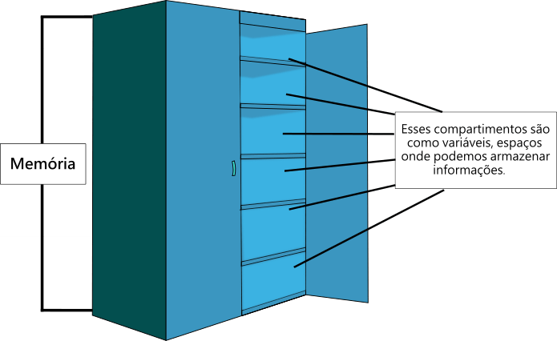

# Variáveis em C

- [Variáveis em C](#variáveis-em-c)
  - [Introdução](#introdução)
  - [Tipos de Dados Básicos](#tipos-de-dados-básicos)
    - [Modificadores de Tipo](#modificadores-de-tipo)
    - [Armazenamento de Variáveis](#armazenamento-de-variáveis)
    - [Inicialização e Atribuição](#inicialização-e-atribuição)
  - [Função sizeof](#função-sizeof)
    - [Funcionamento do `sizeof`](#funcionamento-do-sizeof)
    - [Exemplos com Tipos de Dados](#exemplos-com-tipos-de-dados)
    - [Exemplos com Variáveis](#exemplos-com-variáveis)
    - [Pontos Importantes](#pontos-importantes)
  - [Conclusão](#conclusão)


----------
> << [Voltar ao Índice](README.md)
----------

## Introdução
Em C, uma variável é um nome dado a um local de memória que é usado para armazenar dados. O tipo de uma variável determina o tamanho e o layout desse espaço de memória; o intervalo de valores que podem ser armazenados dentro dessa memória; e o conjunto de operações que podem ser aplicadas à variável.

Imagine a memória do computador como um armário com vários compartimentos etiquetados, de maneira a que compartimento possuí uma etiqueta única.



Os compartimentos são como as variáveis, e o armário é como a memória RAM do computador. A diferença é que uma variável não serve para guardar roupas, apenas dados codificados em forma binária, ou seja, representados através de `0` e `1`, podem ser armazenados.

## Tipos de Dados Básicos
Os tipos de dados básicos em C incluem:

- `int`: Utilizado para armazenar números inteiros. O tamanho é geralmente de 4 bytes (32 bits), mas pode variar dependendo do compilador e da arquitetura da máquina.
- `char`: Para armazenar um único caracter. O tamanho é tipicamente de 1 byte.
- `float`: Usado para armazenar números de ponto flutuante (números com frações). Geralmente ocupa 4 bytes.

- `double`: Semelhante ao float, mas com o dobro da precisão. Normalmente ocupa 8 bytes.

### Modificadores de Tipo
Modificadores de tipo, como short, long, e unsigned, podem ser usados para alterar o intervalo de valores ou o tamanho de um tipo básico.

- `short`: Reduz o tamanho do tipo de dados (geralmente usado com int).
- `long`: Aumenta o tamanho do tipo de dados (pode ser usado com int ou double).
- `unsigned`: Indica que um número será sempre positivo (geralmente usado com int).


### Armazenamento de Variáveis


Cada variável em C tem um local específico na memória. A quantidade de memória alocada depende do tipo de dados da variável. 

Por exemplo:
- Uma variável do tipo `int` normalmente ocupa 4 bytes de memória.
- Uma variável `char` ocupa 1 byte.

Abaixo, está uma tabela  que resume os tipos de dados fundamentais na linguagem de programação C, incluindo o tipo, a quantidade de bytes que cada um ocupa em memória e a gama de valores que podem representar, ou seja, podem ser gravados na memória alocada para cada tipo. 

| Tipo de Dado | Bytes | Gama de Valores |
|--------------|-------|-----------------|
| `char`       | 1     | -128 a 127 ou 0 a 255 |
| `int`        | 4     | -2,147,483,648 a 2,147,483,647 |
| `short`      | 2     | -32,768 a 32,767 |
| `long`       | 4 ou 8 | -2,147,483,648 a 2,147,483,647 ou -9,223,372,036,854,775,808 a 9,223,372,036,854,775,807 |
| `float`      | 4     | Aproximadamente ±3.4E−38 a ±3.4E+38 (6 dígitos de precisão) |
| `double`     | 8     | Aproximadamente ±1.7E−308 a ±1.7E+308 (15 dígitos de precisão) |
| `long double`| 8 ou 16 | Variável, geralmente mais do que `double` |
| `unsigned char` | 1  | 0 a 255 |
| `unsigned int`  | 4  | 0 a 4,294,967,295 |
| `unsigned short`| 2  | 0 a 65,535 |
| `unsigned long` | 4 ou 8 | 0 a 4,294,967,295 ou 0 a 18,446,744,073,709,551,615 |

> É importante notar que os tamanhos e gamas de valores podem variar dependendo da arquitetura do sistema e do compilador, mas os valores fornecidos são típicos para a maioria ambientes.

### Inicialização e Atribuição

Variáveis em C podem ser inicializadas no momento da declaração. Na realidade, nestes casos, estamos perante duas operações. A declaração (`int a`) que é a operação de alocar/atribuir um bloco de memória (neste caso 4 bytes por ser um inteiro) e a escrita de um valor nesse bloco de memória (`=10`) Por exemplo:

```c
int a = 10; // inteiro
char b = 'x'; //caracter
float c = 12.5; //float
```

A atribuição de valores a variáveis já declaradas, ou seja a escrita do valor no bloco de memória dessa variável, é feita usando o operador `=`:

```c
a = 20; // Atribui 20 à variável a
b = 'y'; // Atribui o caracter 'y' à variável b
```

Exemplo de Uso

```c
#include <stdio.h>

int main() {
    int idade = 25;
    char inicial = 'J';
    float altura = 1.75;

    printf("Idade: %d\n", idade);
    printf("Inicial: %c\n", inicial);
    printf("Altura: %.2f\n", altura);

    return 0;
}

```

Neste exemplo, três variáveis de diferentes tipos são declaradas (é alocado um bloco de memória a cada uma), inicializadas (escrita de valores nesses blocos de memória) e os seus valores são impressos no ecrã (leitura do valor existente no bloco de memória).

## Função sizeof

O operador `sizeof` em C é usado para determinar o tamanho, em bytes, de um tipo de dado ou de uma variável. Este tamanho é definido pelo compilador e pode variar dependendo da arquitetura do sistema (32 bits, 64 bits, etc.). O `sizeof` é bastante útil para alocação de memória e para entender como a memória é utilizada por diferentes tipos de dados no programa. Aqui estão alguns pontos importantes e exemplos:

### Funcionamento do `sizeof`
- Retorna o tamanho de um tipo de dado ou variável em bytes.
- É um operador em tempo de compilação, o que significa que o seu resultado é determinado durante a compilação do programa, não em tempo de execução.

### Exemplos com Tipos de Dados

```c
#include <stdio.h>

int main() {
    printf("Tamanho de int: %lu bytes\n", sizeof(int));
    printf("Tamanho de float: %lu bytes\n", sizeof(float));
    printf("Tamanho de char: %lu byte\n", sizeof(char));
    printf("Tamanho de double: %lu bytes\n", sizeof(double));
    return 0;
}
```

Neste exemplo, o programa imprime o tamanho dos tipos de dados `int`, `float`, `char` e `double`. Note que usamos `%lu` no `printf`, pois `sizeof` retorna um `unsigned long`.

### Exemplos com Variáveis

É também, possível, usar o `sizeof` com variáveis:

```c
#include <stdio.h>

int main() {
    int a;
    float b;
    char c;

    printf("Tamanho de a (int): %lu bytes\n", sizeof(a));
    printf("Tamanho de b (float): %lu bytes\n", sizeof(b));
    printf("Tamanho de c (char): %lu byte\n", sizeof(c));
    return 0;
}
```

Neste caso, o programa mostra o tamanho das variáveis `a`, `b` e `c`, que são do tipo `int`, `float` e `char`, respectivamente.

### Pontos Importantes
- `sizeof` retorna um tamanho em bytes, que é a unidade básica de memória.
- O tamanho específico de cada tipo de dado pode variar dependendo do compilador e da arquitetura do sistema.
- É especialmente útil para a alocação dinâmica de memória, como ao usar `malloc`.

O uso de `sizeof` é fundamental em C, pois fornece informações cruciais sobre o consumo de memória de diferentes tipos de dados e variáveis, o que é essencial para a programação eficiente e para evitar erros de memória.

## Conclusão
O entendimento dos tipos de variáveis e como a memória é alocada e utilizada é fundamental para a programação eficiente em C. Com esse conhecimento, é possível escrever programas que utilizam os recursos do sistema de maneira otimizada.