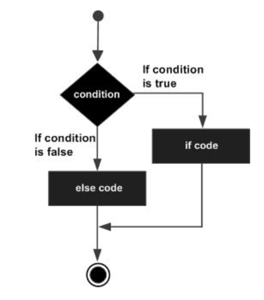

# Estruturas de Decisão Condicional em C

- [Estruturas de Decisão Condicional em C](#estruturas-de-decisão-condicional-em-c)
  - [Estrutura `if` (Decisão condicional simples)](#estrutura-if-decisão-condicional-simples)
    - [Sintaxe](#sintaxe)
    - [Exemplo:](#exemplo)
  - [Estrutura `if - else`](#estrutura-if---else)
      - [Sintaxe](#sintaxe-1)
    - [Exemplo](#exemplo-1)
  - [Encadeamento de vários blocos  `if - else - if ....`](#encadeamento-de-vários-blocos--if---else---if-)
    - [Sintaxe](#sintaxe-2)
    - [Exemplo](#exemplo-2)
  - [Estrutura `switch` (Decisão multipla)](#estrutura-switch-decisão-multipla)
    - [Explicação:](#explicação)
    - [Sintaxe:](#sintaxe-3)
    - [Exemplos:](#exemplos)


----------
> << [Voltar ao Índice](README.md)
----------


As estruturas de decisão condicional em linguagens de programação, como C, são fundamentais para controlar o fluxo de execução do programa. Elas permitem que o programa tome decisões e execute diferentes blocos de código com base em certas condições. 

## Estrutura `if` (Decisão condicional simples)


A instrução `if` é a forma mais simples de tomar uma decisão condicional em C. Ela avalia uma expressão entre parênteses e, se a expressão for verdadeira (ou seja, avalia para um valor não zero), o bloco de código dentro da instrução `if` é executado.

### Sintaxe

```c
if (condição) {
    // Código a executar se a condição for verdadeira
}
```

### Exemplo:
```c
#include <stdio.h>

int main() {
    int number = 10;

    if (number > 5) {
        printf("O número é maior que 5.\n");
    }

    return 0;
}
```

**Output:**

```console
O número é maior que 5.
```

Neste exemplo, a condição `(number > 5)` é verdadeira, então a mensagem "O número é maior que 5." é impressa no standard output.

## Estrutura `if - else`



A instrução `else` é usada em conjunto com o `if` para executar um bloco de código alternativo se a condição do `if` for falsa.

#### Sintaxe
```c
if (condição) {
    // Código a executar se a condição for verdadeira
} else {
    // Código a executar se a condição for falsa
}
```

### Exemplo

```c
#include <stdio.h>

int main() {
    int age = 16;

    if (age >= 18) {
        printf("O user é maior de idade!\n");
    } else {
        printf("O user é menor de idade!\n");
    }

    return 0;
}
```

**Output:**
```
O user é menor de idade!
```

Neste exemplo, a condição `(age >= 18)` é falsa, então o bloco de código dentro do `else` é executado, imprimindo "O user é menor de idade!".

## Encadeamento de vários blocos  `if - else - if ....` 

Existem problemas em que é necessário testar várias condições. Nesse caso, podemos encadear vários blocos de  `if` e `else`.

### Sintaxe
```c
if (condição1) {
    // Código para condição1 verdadeira
} else if (condição2) {
    // Código para condição2 verdadeira ( e caso a condição 1 seja falsa)
} else {
    // Código se nenhuma das condições anteriores for verdadeira
}
```

### Exemplo
```c
#include <stdio.h>

int main() {
    int score = 75;

    if (score >= 90) {
        printf("Excelente!\n");
    } else if (score >= 70) {
        printf("Bom!\n");
    } else {
        printf("Tente novamente!\n");
    }

    return 0;
}
```

**Output:**
```
Bom!
```

Neste exemplo, a variável `score` é avaliada contra várias condições. Como `score` é 75, que satisfaz a condição `(score >= 70)` mas não `(score >= 90)`, o programa imprime "Bom!".


## Estrutura `switch` (Decisão multipla)


A estrutura `switch` em C é uma forma de controle condicional que permite que o código responda a diferentes valores de uma única variável ou expressão. É uma alternativa eficiente para múltiplos `if` e `else if` statements, especialmente quando se trata de comparar a mesma variável contra vários valores.

### Explicação:
- A estrutura `switch` testa o valor de uma variável ou expressão contra uma lista de `case`s.
- Cada `case` especifica um valor a ser comparado e o bloco de código a ser executado se a comparação for verdadeira.
- O `break` é frequentemente usado ao final de cada bloco de `case` para evitar que a execução "caia" nos casos subsequentes. Caso não seja utilizado executa os blocos posteriores.
- Um `default` opcional pode ser incluído para lidar com qualquer valor que não corresponda a nenhum dos `case`s testados.

### Sintaxe:
```c
switch (expressão) {
  case valor1:
    // Bloco de código para valor1
    break;
  case valor2:
    // Bloco de código para valor2
    break;
  // mais cases...
  default:
    // Bloco de código se nenhum case corresponder
}
```

### Exemplos:

**Exemplo 1**

```c
#include <stdio.h>

int main() {
    char grade = 'B';

    printf("A avaliar o grau '%c':\n", grade);
    switch (grade) {
        case 'A':
            printf("Excelente!\n");
            break;
        case 'B':
        case 'C':
            printf("Bem feito\n");
            break;
        case 'D':
            printf("Você passou\n");
            break;
        case 'F':
            printf("Melhor tentar novamente\n");
            break;
        default:
            printf("Grau inválido\n");
    }
    return 0;
}
```

**Output esperado:**
```
A avaliar o grau 'B':
Bem feito
```

**Exemplo 2**

```c
#include <stdio.h>

int main() {
    int day = 4; // Vamos considerar que 1 = Domingo, 2 = Segunda, ..., 7 = Sábado

    printf("Sugestão de atividade para o dia %d:\n", day);
    switch (day) {
        case 1:
            printf("Domingo: Tempo para a família!\n");
            break;
        case 2:
        case 3:
        case 4:
            printf("Dia útil: Vamos trabalhar!\n");
            // Observe que não há 'break' aqui
        case 5:
            printf("Quinta-feira: Quase lá... Prepare-se para o fim de semana!\n");
            break;
        case 6:
            printf("Sexta-feira: Noite de filme!\n");
            break;
        case 7:
            printf("Sábado: Dia de descansar ou sair para uma aventura!\n");
            break;
        default:
            printf("Dia inválido! O dia deve estar entre 1 e 7.\n");
    }
    return 0;
}
```

- Este programa sugere atividades com base no dia da semana.
- Os dias úteis (segunda a quarta) são agrupados juntos sem um `break` entre eles. Isso significa que se `day` for 2, 3 ou 4, o programa entrará nesses casos, mas como não há um `break` após "Vamos trabalhar!", ele também executará o caso para quinta-feira.

**Output esperado se `day = 4`:**
```
Sugestão de atividade para o dia 4:
Dia útil: Vamos trabalhar!
Quinta-feira: Quase lá... Prepare-se para o fim de semana!
```

Neste exemplo, podemos ver que quando `day = 4` (Quarta-feira), o programa entra no bloco de código para dias úteis, mas como não há um `break` no final desse bloco, ele continua a executar o próximo caso (Quinta-feira). Isso ilustra a importância do `break` para controlar o fluxo da estrutura `switch` adequadamente. Sem ele, o programa pode executar blocos de código que não se pretendia que fossem executados para determinados casos.
