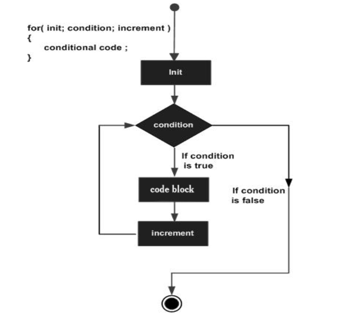
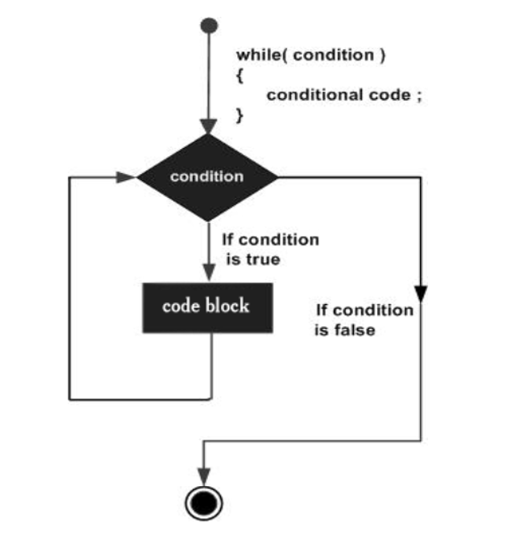
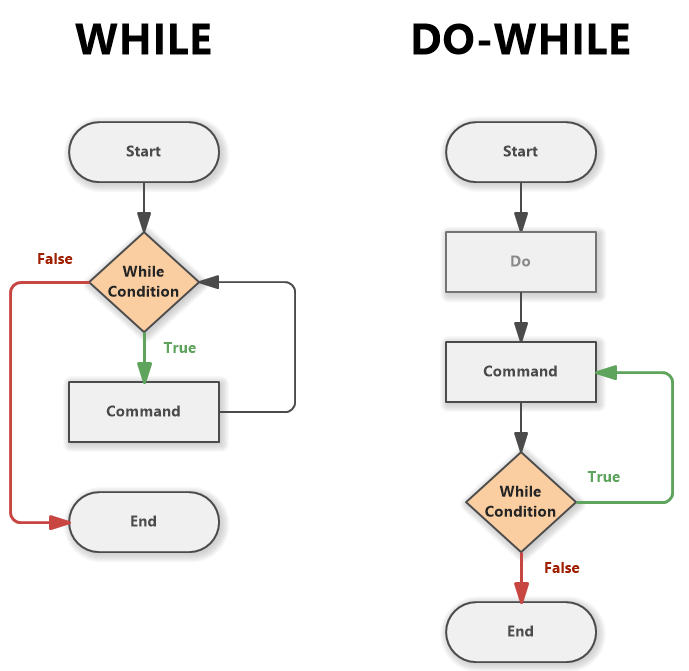
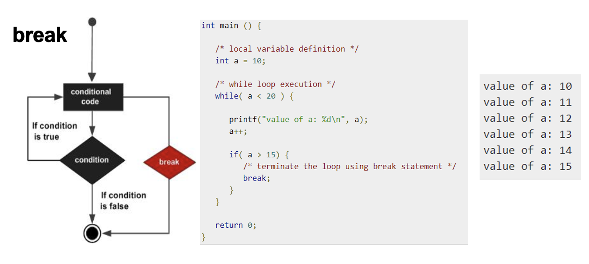
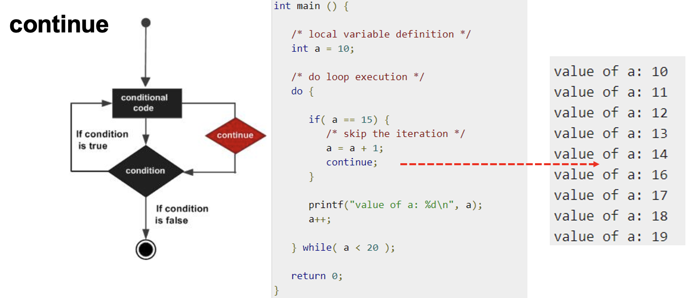

# Estruturas de repetição (Ciclos)

- [Estruturas de repetição (Ciclos)](#estruturas-de-repetição-ciclos)
  - [Ciclo `for`](#ciclo-for)
    - [Funcionamento:](#funcionamento)
    - [Casos de uso:](#casos-de-uso)
    - [Sintaxe:](#sintaxe)
    - [Exemplos:](#exemplos)
      - [1. Loop For Normal:](#1-loop-for-normal)
      - [2. Loop com Incremento Diferente:](#2-loop-com-incremento-diferente)
      - [3. loop Infinito:](#3-loop-infinito)
      - [4. Loops aninhados](#4-loops-aninhados)
  - [Ciclo `while`](#ciclo-while)
    - [Funcionamento:](#funcionamento-1)
    - [Casos de uso:](#casos-de-uso-1)
    - [Sintaxe:](#sintaxe-1)
    - [Exemplos:](#exemplos-1)
      - [1. Loop While Básico:](#1-loop-while-básico)
      - [2. While com Condição Complexa:](#2-while-com-condição-complexa)
      - [3. Ciclo Infinito:](#3-ciclo-infinito)
  - [Ciclo `do-while`](#ciclo-do-while)
    - [Funcionamento:](#funcionamento-2)
    - [Casos de uso:](#casos-de-uso-2)
    - [Sintaxe:](#sintaxe-2)
    - [Exemplos:](#exemplos-2)
      - [1. Loop Do-While Básico:](#1-loop-do-while-básico)
      - [2. Validando Entrada:](#2-validando-entrada)
      - [3. Ciclo com Condição Falsa na Inicialização:](#3-ciclo-com-condição-falsa-na-inicialização)
      - [4. Menu](#4-menu)
  - [Controlo de fluxo em ciclos](#controlo-de-fluxo-em-ciclos)
    - [Break:](#break)
      - [Exemplos de Break:](#exemplos-de-break)
        - [1. Interromper um Loop Quando uma Condição é Verdadeira:](#1-interromper-um-loop-quando-uma-condição-é-verdadeira)
        - [2. Sair de um Loop Infinito:](#2-sair-de-um-loop-infinito)
    - [Continue:](#continue)
      - [Exemplos de Continue:](#exemplos-de-continue)
        - [1. Saltar/Ignorar Números Específicos:](#1-saltarignorar-números-específicos)
        - [2. Processamento Condicionado dentro de um Loop:](#2-processamento-condicionado-dentro-de-um-loop)


----------
> << [Voltar ao Índice](README.md)
----------

Uma estrutura de repetição é utilizada quando se deseja repetir um bloco do programa ou até mesmo o programa inteiro. O número de repetições pode ser um número fixo ou estar relacionado a uma condição definida pelo programador. Dessa maneira, há três tipos de estruturas de repetição que podem ser utilizadas para cada situação.

## Ciclo `for`

O ciclo `for` em C é uma estrutura de controlo que permite repetir um bloco de código um número específico de vezes. É comumente usado quando o número de iterações é conhecido antes de entrar no loop.

### Funcionamento:



- **Inicialização:** Antes do primeiro loop, define-se uma variável contadora.
- **Condição:** Antes de cada iteração, verifica-se se a condição definida ainda é verdadeira. Se for, o bloco de código dentro do `for` é executado. Se não, o loop termina.
- **Incremento:** Após cada iteração do loop, a variável contadora é atualizada (geralmente incrementada, mas sempre conforme a expressão).

### Casos de uso:
1. **Repetir uma ação um número fixo de vezes:** Contar até um determinado número, processar cada elemento de um array, etc.
2. **Operações em arrays e coleções:** Quando é necessário aceder ou modificar cada elemento de um array.
3. **Ciclos controlados por condições múltiplas:** Onde mais de uma condição determina a continuidade do loop.

### Sintaxe:
```c
for (inicialização; condição; incremento) {
    // Bloco de código a ser repetido
}
```

### Exemplos:

#### 1. Loop For Normal:
**Objetivo:** Imprimir os números de 1 a 5.
```c
#include <stdio.h>

int main() {
    for (int i = 1; i <= 5; i++) {
        printf("%d\n", i);
    }
    return 0;
}
```
**Output:**
```
1
2
3
4
5
```

#### 2. Loop com Incremento Diferente:
**Objetivo:** Imprimir os primeiros cinco múltiplos de 3.
```c
#include <stdio.h>

int main() {
    for (int i = 3; i <= 15; i += 3) { // Incremento de i em 3 a cada iteração
        printf("%d\n", i);
    }
    return 0;
}
```
**Output:**
```
3
6
9
12
15
```

#### 3. loop Infinito:
**Objetivo:** Executar um loop que continua indefinidamente até ser interrompido externamente (por exemplo, pelo utilizador).
```c
#include <stdio.h>

int main() {
    for (;;) { // Nenhuma inicialização, condição ou incremento
        printf("Este loop irá correr para sempre até ser interrompido.\n");
        // Normalmente, haveria alguma condição de saída ou pausa aqui. Por exemplo um if
    }
    return 0;
}
```

#### 4. Loops aninhados

Ciclos aninhados em C são loops dentro de outros loops. Eles são úteis para situações que requerem processamento multi-nível, como trabalhar com matrizes multidimensionais (2D), realizar tarefas repetitivas dentro de outras tarefas repetitivas. Aqui está um exemplo que utiliza ciclos `for` aninhados para imprimir uma tabela de multiplicação:

 **Código:**

```c
#include <stdio.h>

int main() {
    int size = 10; // Define o tamanho da tabela de multiplicação
    printf("Tabela de Multiplicação:\n");

    // Loop externo - controla a linha da tabela
    for (int i = 1; i <= size; i++) {
        // Loop interno - controla a coluna da tabela
        for (int j = 1; j <= size; j++) {
            printf("%d\t", i * j); // Imprime o produto de i e j, seguido de uma tabulação
        }
        printf("\n"); // Quebra de linha após cada linha da tabela ser impressa
    }
    return 0;
}
```

**Funcionamento:**
- O programa define o tamanho da tabela de multiplicação que deseja criar (`size = 10`).
- O loop externo (`for` com a variável `i`) itera através das linhas da tabela.
- Para cada linha, o loop interno (`for` com a variável `j`) itera através das colunas.
- Dentro do loop interno, o programa calcula e imprime o produto de `i` e `j`, que são os valores atuais das linhas e colunas, respectivamente.
- Após cada linha ser impressa, uma quebra de linha é adicionada para começar a próxima linha da tabela.

**Output:**
O programa imprimirá uma tabela de multiplicação 10x10, onde cada célula é o produto dos números da linha e da coluna correspondentes.

```
1	2	3	4	5	6	7	8	9	10	
2	4	6	8	10	12	14	16	18	20	
3	6	9	12	15	18	21	24	27	30	
... e assim por diante até 10x10
```

## Ciclo `while`

O ciclo `while` em C é uma estrutura de controle que permite repetir um bloco de código enquanto uma condição especificada é verdadeira. É comumente usado quando o número de iterações não é conhecido antes do início do loop.

### Funcionamento:



- **Condição:** Antes de cada iteração, o `while` verifica se a condição especificada é verdadeira. Ao contrário do anterior, é o programador que terá que alterar o valor da condição
- **Execução do Bloco de Código:** Se a condição for verdadeira, o bloco de código dentro do `while` é executado.
- **Reavaliação:** Após a execução do bloco de código, a condição é reavaliada. Se ainda for verdadeira, o loop continua; caso contrário, o loop termina.

### Casos de uso:
1. **Leitura de dados até um marcador:** Por exemplo, continuar a ler entradas até que o utilizador digite um determinado valor.
2. **Espera por uma condição:** Continuar o loop até que um determinado estado seja alcançado ou uma condição seja satisfeita.
3. **Processamento de elementos de uma lista:** Quando não se sabe o número exato de elementos ou a condição de término não está vinculada a um número fixo de iterações.

### Sintaxe:

```c
while (condição) {
    // Bloco de código a ser repetido
}
```

### Exemplos:

#### 1. Loop While Básico:

**Objetivo:** Imprimir os números de 1 a 5.
```c
#include <stdio.h>

int main() {
    int i = 1;
    while (i <= 5) {
        printf("%d\n", i);
        i++;
    }
    return 0;
}
```
**Output:**
```
1
2
3
4
5
```

#### 2. While com Condição Complexa:
**Objetivo:** Imprimir os primeiros cinco números pares.
```c
#include <stdio.h>

int main() {
    int i = 1;
    int count = 0;
    while (count < 5) {
        if (i % 2 == 0) {
            printf("%d\n", i);
            count++;
        }
        i++;
    }
    return 0;
}
```
**Output:**
```
2
4
6
8
10
```

#### 3. Ciclo Infinito:
**Objetivo:** Executar um loop que continua indefinidamente até ser interrompido externamente.

```c
#include <stdio.h>

int main() {
    while (1) { // Condição sempre verdadeira
        printf("Este loop rodará para sempre até ser interrompido.\n");
        // Normalmente, haveria alguma condição de saída aqui.
    }
    return 0;
}
```


## Ciclo `do-while`

O ciclo `do-while` em C é uma variante do ciclo `while` que garante que o bloco de código seja executado pelo menos uma vez antes de verificar a condição. É usado quando se deseja que o bloco de código seja executado pelo menos uma vez, independentemente da condição ser inicialmente verdadeira ou falsa.

### Funcionamento:



- **Execução Inicial:** O bloco de código dentro do `do` é executado uma vez incondicionalmente.
- **Condição:** Após a execução inicial, a condição é verificada.
- **Loop Continuado:** Se a condição for verdadeira, o bloco de código é executado novamente. Esse processo continua até que a condição se torne falsa.

### Casos de uso:
1. **Menus interativos:** Onde uma ação é realizada pelo menos uma vez, e o utilizador decide se deseja continuar.
2. **Validação de entrada:** Garantir que uma entrada seja recebida e validada antes de prosseguir.
3. **Jogos e repetições de tarefas:** Onde uma tarefa é realizada e, em seguida, uma condição é verificada para determinar se a tarefa deve ser repetida.

### Sintaxe:
```c
do {
    // Bloco de código a ser repetido
} while (condição);
```

### Exemplos:

#### 1. Loop Do-While Básico:
**Objetivo:** Imprimir números de 1 a 5, garantindo que o loop seja executado pelo menos uma vez.
```c
#include <stdio.h>

int main() {
    int i = 1;
    do {
        printf("%d\n", i);
        i++;
    } while (i <= 5);
    return 0;
}
```
**Output:**
```
1
2
3
4
5
```

#### 2. Validando Entrada:
**Objetivo:** Continuar solicitando ao usuário um número até que ele insira um número positivo.
```c
#include <stdio.h>

int main() {
    int number;
    do {
        printf("Insira um número positivo: ");
        scanf("%d", &number);
        if(number <= 0) {
            printf("Erro: O número não é positivo.\n");
        }
    } while (number <= 0);
    printf("Você inseriu: %d\n", number);
    return 0;
}
```

#### 3. Ciclo com Condição Falsa na Inicialização:
**Objetivo:** Demonstrar a execução de um loop `do-while` com uma condição que é falsa desde o início.
```c
#include <stdio.h>

int main() {
    int i = 10;
    do {
        printf("Isto será impresso uma vez, embora a condição seja inicialmente falsa.\n");
    } while (i < 1);
    return 0;
}
```
**Output:**
```
Será impresso uma vez, embora a condição seja inicialmente falsa.
```

#### 4. Menu

**Objetivo:** Demonstrar a utilização de um possível menu

```c
#include <stdio.h>

int main() {
    int choice;

    do {
        // Exibe o menu
        printf("\nMenu de Opções:\n");
        printf("1. Imprimir Olá\n");
        printf("2. Imprimir Adeus\n");
        printf("3. Exibir créditos\n");
        printf("4. Sair\n");
        printf("Escolha uma opção (1-4): ");
        scanf("%d", &choice);

        // Processa a escolha do utilizador
        switch (choice) {
            case 1:
                printf("Olá!\n");
                break;
            case 2:
                printf("Adeus!\n");
                break;
            case 3:
                printf("Programa feito por mim.\n");
                break;
            case 4:
                printf("Saindo...\n");
                break;
            default:
                printf("Opção inválida! Tente novamente.\n");
        }
    } while (choice != 4);  // Continua a imprimir o menu até que o user escolha '4' para sair

    return 0;
}

```

**Funcionamento:**

- O programa exibe um menu com quatro opções.
- O user insere um número para escolher uma opção.
- O programa usa uma estrutura switch para executar um bloco de código com base na escolha do user.
- Se a opção for 1, 2 ou 3, o programa executa a ação correspondente e, em seguida, o menu é exibido novamente.
- Se a opção for 4, o programa imprime uma mensagem de despedida e o loop termina.
- Se uma opção inválida for inserida, o programa notifica o user e apresenta o menu novamente.


## Controlo de fluxo em ciclos

O controle de fluxo dentro dos ciclos em C pode ser manipulado através das instruções `break` e `continue`. Ambas são usadas para alterar o comportamento normal de ciclos `for`, `while` e `do-while`.

### Break:



A instrução `break` termina imediatamente o ciclo mais interno (seja `for`, `while` ou `do-while`) em que se encontra. Após um `break`, o programa continua e é executado o código imediatamente após o bloco do loop.

#### Exemplos de Break:

##### 1. Interromper um Loop Quando uma Condição é Verdadeira:

**Objetivo:** Parar o loop quando um número divisível por 7 for encontrado.

```c
#include <stdio.h>

int main() {
    for (int i = 1; i <= 100; i++) {
        if (i % 7 == 0) {
            printf("O primeiro múltiplo de 7 entre 1 e 100 é: %d\n", i);
            break; // Sai do loop quando encontra um múltiplo de 7
        }
    }
    return 0;
}
```

##### 2. Sair de um Loop Infinito:

**Objetivo:** Sair de um loop infinito sob uma condição específica.

```c
#include <stdio.h>

int main() {
    int count = 0;
    while (1) { // Loop infinito
        printf("Dentro do loop.\n");
        if (++count == 5) {
            printf("Saindo do loop.\n");
            break; // Sai do loop após 5 iterações
        }
    }
    return 0;
}
```

### Continue:



A instrução `continue` interrompe a iteração atual de um ciclo e inicia a próxima iteração. Isso significa que, no caso do `continue`, o loop não é terminado, mas sim é dado oo início da próxima iteração, ignorando o restante do código no corpo do loop para a iteração atual.

> No caso de cum ciclo `for`, a função de incremento e o teste da condição é feito. No caso do while terá que ser o programador a efetuar e a prever essa situação antes de executar o comendo `continue`

#### Exemplos de Continue:

##### 1. Saltar/Ignorar Números Específicos:

**Objetivo:** Imprimir números de 1 a 10, exceto aqueles divisíveis por 3.

```c
#include <stdio.h>

int main() {
    for (int i = 1; i <= 10; i++) {
        if (i % 3 == 0) {
            continue; // Salta o resto do código do loop para números divisíveis por 3
        }
        printf("%d\n", i);
    }
    return 0;
}
```

##### 2. Processamento Condicionado dentro de um Loop:

**Objetivo:** Processar apenas números ímpares num intervalo.

```c
#include <stdio.h>

int main() {
    int i = 0;
    while (i < 10) {
        i++;
        if (i % 2 == 0) {
            continue; // Pula números pares
        }
        printf("Número ímpar: %d\n", i); // Executado apenas para números ímpares
    }
    return 0;
}
```
