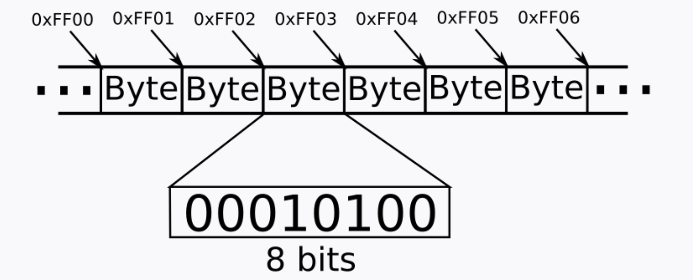
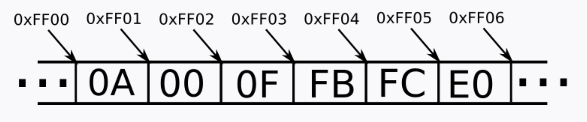
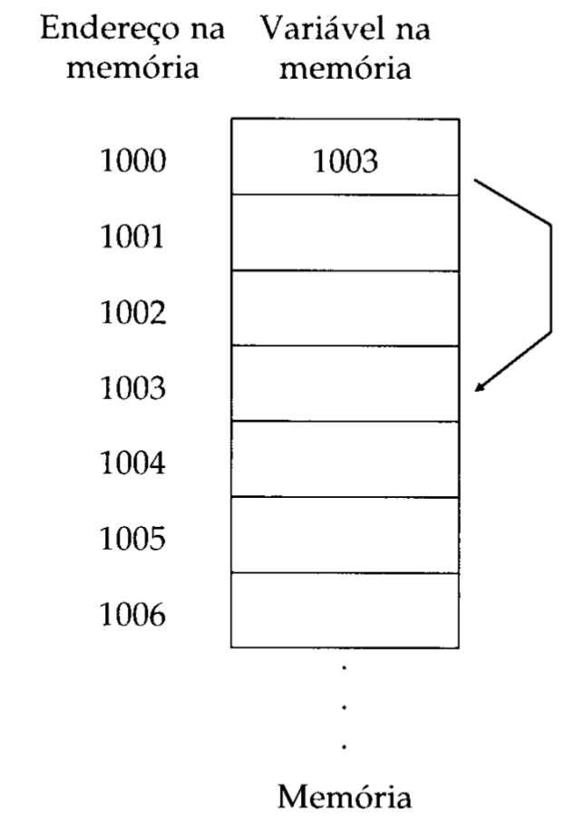
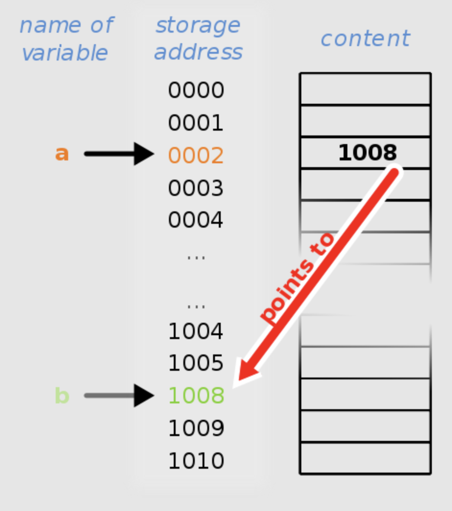
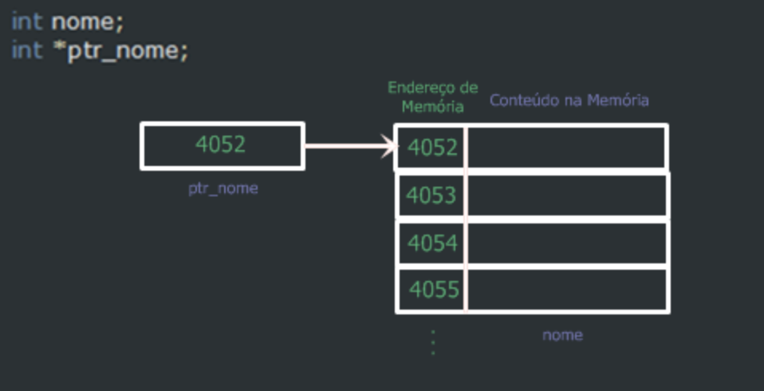

# 07. Ponteiros em C

- [07. Ponteiros em C](#07-ponteiros-em-c)
  - [Entender a memória](#entender-a-memória)
    - [dimensão da memória](#dimensão-da-memória)
    - [Tabela de bases](#tabela-de-bases)
    - [Memória e armazenamento de variáveis](#memória-e-armazenamento-de-variáveis)
  - [O que são Ponteiros](#o-que-são-ponteiros)
  - [Porque são importantes?](#porque-são-importantes)
  - [Atribuir valores a ponteiros](#atribuir-valores-a-ponteiros)


 O correto entendimento e uso de ponteiros é crítico para uma correta programação em C. Existem três razões para isso: 
 - Os ponteiros fornecem os meios pelos quais as funções podem modificar os seus argumentos; 
 - Os ponteiros são usados para suportar as rotinas (funções) de alocação dinâmica de memória;
 - O uso de ponteiros pode aumentar a eficiência de certas rotinas.

## Entender a memória

Contudo, antes de falarmos sobre ponteiros, é essencial entender como a memória do computador funciona.

A memória RAM é o armazenamento primário do computador, onde ficam informações (dados e instruções) dos programas sendo atualmente executados pelo computador. Isso significa, entre outras coisas, que as variáveis dos nossos programas ficam armazenadas na memória durante a execução.

Na figura abaixo, podemos ver a memória como um grande array de endereços. Como a memória é byte addressed, cada endereço é referente a 1 byte (8 bits).



### dimensão da memória

Calculamos o **tamanho da memória** (ou seja qual a quantidade de Bytes que um programa pode utilizar para guardar a sua informação) a partir do tamanho dos endereços (número de Bytes endereçáveis). No exemplo acima, um endereço era um número hexadecimal de 4 dígitos (`0xFF00`), o que significa:
- `0x` indica que o número está em base hexadecimal.
- Cada dígito hexadecimal equivale a 4 dígitos binários (veja tabela de bases abaixo).
- Portanto, cada endereço do exemplo da imagem possui 16 bits.

Como cada byte da memória necessita de um endereço correspondente, calculamos o tamanho da memória vendo quantos endereços diferentes a memória é capaz de endereçar. No exemplo, cada endereço possui 16 bits, que podem representar 216 endereços, ou seja, esta memória é de 64 KB.

O que determina o tamanho da memória é o tipo de processador:
- Processador x86 faz endereçamento com 32 bits. Portanto o tamanho máximo é `2^32` o que significa bytes = 4GB (ou seja cada endereço possui 8 simbolos Hexadecimais)
- Processador x64 faz endereçamento com 48 bits. Portanto o tamanho máximo é `2^48` o que significa bytes = 256TB (ou seja cada endereço possui 12 simbolos Hexadecimais)

Pode facilmente verificar no seu sistema, e através de um pequeno programa em C, qual o espaço de memória RAM atribuido para a execução do programa:

```c
int main(int argc, char const *argv[])
{
    int a;
    printf("%p\n",&a);
    return EXIT_SUCCESS;
}
```

**Possível Output**

```console
0x7ffd89fe6ce4
```

Este tipo de saída indica a utilização de um processador x64.

### Tabela de bases

| Decimal | Hexadecimal | Binário  |
|---------|-------------|----------|
| 0       | 0           | 0000     |
| 1       | 1           | 0001     |
| 2       | 2           | 0010     |
| 3       | 3           | 0011     |
| 4       | 4           | 0100     |
| 5       | 5           | 0101     |
| 6       | 6           | 0110     |
| 7       | 7           | 0111     |
| 8       | 8           | 1000     |
| 9       | 9           | 1001     |
| 10      | A           | 1010     |
| 11      | B           | 1011     |
| 12      | C           | 1100     |
| 13      | D           | 1101     |
| 14      | E           | 1110     |
| 15      | F           | 1111     |


### Memória e armazenamento de variáveis

Podemos utilizar a memória para:

- Utilizamos a memória todas as vezes que alocamos espaço para variáveis nos nossos programas.
- Ler valores de variáveis e escrever novos valores para as variáveis. Os valores lidos e escritos são sempre bytes.

Do ponto de vista da **máquina**, na memória **estão armazenados apenas bits**. Veja no exemplo abaixo, em que cada byte é representado em base hexadecimal (por simplificação).



Já do ponto de vista do **programador**, o que está armazenado na memória depende do tipo de variável associado ao endereço a que nos referimos.

- Se avaliarmos o byte do endereço 0xFF00 como um char, ele será avaliado como `\n`
- Se avaliarmos o byte no endereço 0xFF03 como um char, ele será avaliado como `û`
- Interpretando a sequência de 4 bytes a partir do endereço `0xFF01` como `int`, ela será avaliada como **1047548**
- Interpretando a sequência de 4 bytes a partir do endereço `0xFF00` como um `float`, ela será avaliada como **6.16598e-33**

> O tipo da variável define 3 situações:
>- Quantos bytes a variável ocupa na memória
>- Como interpretar o padrão de bytes
>- Operações aritméticas 


## O que são Ponteiros

Um ponteiro é uma variável que contém um endereço de memória. Esse endereço é normalmente a posição de uma outra variável na memória. Se uma variável contém o endereço de uma outra, então a primeira variável é vista como um apontador para a segunda.



Se uma variável irá conter um ponteiro, ela deve ser declarada como tal. Uma declaração de ponteiro consiste no tipo de base, um `*` e o nome da variável. A forma geral para declarar uma variável do tipo ponteiro é:

```text
tipo *nome
```

onde tipo é qualquer tipo válido em C e nome é o nome da variável ponteiro.

```c
int *ptr;  // ptr é um ponteiro para um inteiro
char *cptr; // cptr é um ponteiro para um caractere

```

```c
int *ptr = NULL; // ptr é inicializado como NULL

```

> Inicialmente, um ponteiro não inicializado aponta para um local de memória indefinido (depende do que está escrito na memória). É uma boa prática inicializar ponteiros com NULL até que lhe sejam atribuídos um endereço válido


O tipo base do ponteiro define para que tipo de variáveis o ponteiro pode apontar. Tecnicamente, qualquer tipo de ponteiro pode apontar para qualquer lugar na memória. No entanto, toda a aritmética de ponteiros é feita por meio do tipo base, assim, é importante declarar o ponteiro corretamente.

> Então se um ponteiro é uma variável que armazena um endereço, o espaço que ocupa em memória tem a ver com o espaço necessário para guardar a dimensão do endereço. No caso de um processador x64, apesar de só usar 48 bits para endereçamento (6 bytes), um ponteiro ocupa sempre 8 bytes.

## Porque são importantes?

- **Acesso Direto à Memória:** Ponteiros permitem que se aceda e modifique a memória diretamente, o que pode levar a programas mais eficientes.
- **Passagem de Referência:** Ao usar ponteiros, é possível passar o endereço de uma variável para uma função, permitindo que a função modifique o valor original da variável.
- **Alocação Dinâmica de Memória:** Com ponteiros, é possível alocar e libertar memória dinamicamente durante a execução do programa.
- **Arrays, Strings e Estruturas:** Ponteiros são fundamentais para trabalhar com arrays, strings e estruturas, oferecendo uma maneira flexível de aceder e manipular esses tipos de dados.

## Atribuir valores a ponteiros

Um ponteiro recebe o endereço de uma variável através do operador de endereço (&):

```c
int var = 5;
int *ptr = &var; // ptr agora aponta para o endereço de var

```

Para aceder ao valor do local de memória para o qual o ponteiro aponta, usamos o operador de desreferenciação (*), também conhecido como operador de indireção:

```c
printf("%d", *ptr); // Imprime o valor de var, que é 5

```

> **Importante**: Os ponteiros são no ofundo variáveis que guardam o local de memória de outra variável. Nos próximas aulas iremos ver em detalhe a sua utilização em funções, em estruturas, na alocação dinâmica de memória e como podem ser uteis para construir estruturas e modelos de dados (Filas, Pilhas, grafos, etc) que nos irão permitir criar programas mais complexos. Veja as imagens abaixo



