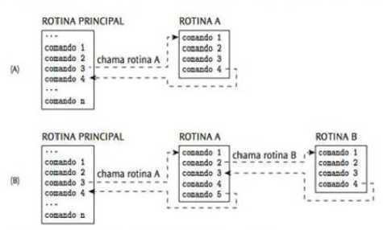
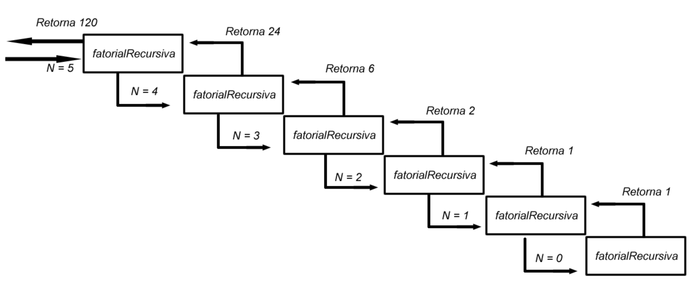

# 08. Funções em C
- [08. Funções em C](#08-funções-em-c)
  - [Enquadramento](#enquadramento)
  - [Sintaxe básica](#sintaxe-básica)
  - [Exemplo de função simples](#exemplo-de-função-simples)
  - [Argumentos por valor e por referência](#argumentos-por-valor-e-por-referência)
    - [argumentos por valor](#argumentos-por-valor)
    - [Argumentos por referência](#argumentos-por-referência)
  - [Variáveis Locais e Globais](#variáveis-locais-e-globais)
    - [Variáveis Locais](#variáveis-locais)
    - [Variáveis Globais](#variáveis-globais)
    - [Considerações finais](#considerações-finais)
  - [Funções recursivas](#funções-recursivas)
    - [Componentes de uma Função Recursiva](#componentes-de-uma-função-recursiva)
    - [Vantagens e Desvantagens](#vantagens-e-desvantagens)


## Enquadramento
Funções em C são blocos de código que realizam uma tarefa específica e podem ser chamados em diferentes partes do programa. Isso ajuda a tornar o código mais organizado, modular e reutilizável. 


O fluxo de execução de um programa, ou fluxo de controle, é a sequência de comandos executados pelo programa durante o seu processamento. Normalmente o fluxo é sequencial, iniciando no primeiro comando (da função main) e prosseguindo com os demais, em sequência linear, até se atingir o último. Contudo, esta sequência de fluxo pode ser modificada por comandos de desvio ou chamadas a rotinas/procedimentos separados (funções).

A figura abaixo ilustra o procedimento de chamada de rotinas. Em (A) a execução do comando 3 da rotina principal faz o fluxo de execução ser desviado para o primeiro comando da rotina A. O processamento da rotina principal é interrompido, tendo inicio o processamento dos comandos da rotina A até ao último, quando então o fluxo retoma à rotina principal, reiniciando o seu processamento a partir do ponto imediatamente posterior ao ponto de chamada.

Podemos ainda ter chamadas encadeadas. Em (B) mostra-se uma situação em que o comando 3 da rotina principal chama a rotina A e o comando 2 da rotina A invoca a rotina B. Na rotina principal, o comando 3 causa a interrupção do seu processamento e o desvio do fluxo de execução para o primeiro comando da rotina A e ai por diante...



## Sintaxe básica
A sintaxe básica de uma função em C é a seguinte:

```c
tipo_retornado nome_da_funcao (lista_de_argumentos) {
   // corpo da função
   // declarações de variáveis locais
   // instruções
   return expressão;
}
```
Os componentes da definição da função são:

- `tipo_retornado`: é o tipo de valor que a função retorna. Pode ser int, float, char, void ou qualquer outro tipo de dados em C.
- `nome_da_funcao`: é o nome da função. Esse nome é usado para chamar a função em outras partes do programa.
- l`ista_de_argumentos:` é a lista de argumentos que a função recebe. Os argumentos são valores que são passados para a função para que ela possa realizara tarefa.
- `corpo da função:` é o bloco de código que executa a tarefa da função. Aqui, você pode declarar variáveis locais, realizar operações e fazer outras instruções.
- `return expressão`: é a instrução que retorna um valor da função. A expressão é opcional e pode ser qualquer valor do tipo de dados tipo_retornado.

## Exemplo de função simples
Aqui está um exemplo de função simples que calcula o quadrado de um número:

```c
#include <stdio.h>

int quadrado(int x) {
    int resultado = x * x;
    return resultado;
}

int main() {
    int num = 5;
    int resultado = quadrado(num);
    printf("O quadrado de %d é %d\n", num, resultado);
    return 0;
}
```
Aqui, a função `quadrado` recebe um argumento `x` e retorna o quadrado desse número. Na função `main`, chamamos a função quadrado com o argumento `num` e armazenamos o resultado em uma variável `resultado`. Em seguida, usamos a função `printf` para exibir o resultado.

## Argumentos por valor e por referência
Em C, podemos passar argumentos para uma função por valor ou por referência. Quando se passa um argumento por valor, a função recebe uma cópia do valor original. Quando se passa um argumento por referência, a função recebe o endereço de memória do valor original.

### argumentos por valor
Aqui está um exemplo de passagem de argumentos por valor:

```c
#include <stdio.h>

void increment(int x) {
    x++;
    printf("O valor de x dentro da função é %d\n", x);
}

int main() {
    int num = 5;
    increment(num);
    printf("O valor de num depois da função é %d\n", num);
    return 0;
}
```

Neste exemplo, definimos uma função `increment` que recebe um argumento `x` e incrementa seu valor. Na função `main`, chamamos a função `increment` com o argumento num. No entanto, o valor de num não é modificado pela função `increment` porque passamos o valor de num por valor.

### Argumentos por referência
Para passar um argumento por referência, é necessário usar um ponteiro. Um ponteiro é uma variável que armazena o endereço de memória de outra variável.

A sintaxe para passar um argumento por referência é a seguinte:

```c
tipo_retornado nome_da_funcao (tipo_argumento *nome_do_ponteiro) {
   // corpo da função
   // instruções
}
```
Um exemplo de como usar a passagem de valor por referência em uma função que troca o valor de duas variáveis:

```c
#include <stdio.h>

void trocar(int *a, int *b) {
    int temp = *a;
    *a = *b;
    *b = temp;
}

int main() {
    int x = 5, y = 10;
    printf("Antes da troca: x = %d, y = %d\n", x, y);
    trocar(&x, &y);
    printf("Depois da troca: x = %d, y = %d\n", x, y);
    return 0;
}

```

Neste exemplo, definimos uma função trocar que recebe dois argumentos por referência `a` e `b`. Na função main, criamos duas variáveis `x` e `y` e as exibimos usando a função `printf`. Em seguida, chamamos a função `trocar` com os endereços de `x` e `y`. Dentro da função `trocar`, usamos ponteiros para trocar os valores de `a` e `b`. Finalmente, exibimos os valores de `x` e `y ` novamente usando a função `printf`.

Observe que passamos os endereços de x e y para a função trocar usando o operador de referência **&**. Dentro da função trocar, usamos o operador de indireção `*` para aceder aos valores apontados pelos ponteiros a e b.

## Variáveis Locais e Globais
Em C, as variáveis podem ser declaradas em dois âmbitos diferentes: local ou global. Uma variável local é definida dentro de uma função e só é acessível dentro dessa função. Uma variável global, por outro lado, é definida fora de qualquer função e pode ser acessada por todas as funções do programa.


### Variáveis Locais
Uma variável local é declarada dentro do corpo de uma função. Ela só é acessível dentro dessa função e é destruída quando a função retorna. Aqui está um exemplo de como declarar e usar uma variável local em C:

```c
#include <stdio.h>

int main() {
    int x = 10; // variável local
    printf("O valor de x é %d\n", x);
    return 0;
}
```

Neste exemplo, a variável `x` é definida dentro da função main. Ela só pode ser acedida dentro dessa função e é destruída quando a função retorna.

### Variáveis Globais
Uma variável global é declarada fora do corpo de qualquer função. Ela pode ser acedida por todas as funções do programa. Aqui está um exemplo de como declarar e usar uma variável global em C:

```c
#include <stdio.h>

int x = 10; // variável global

void funcao() {
    printf("O valor de x é %d\n", x);
}

int main() {
    printf("O valor de x é %d\n", x);
    funcao();
    return 0;
}
```

Neste exemplo, a variável `x` é definida fora do corpo de qualquer função. Ela pode ser acedida por todas as funções do programa, incluindo a função `funcao` e a função `main`.

### Considerações finais
Ao trabalhar com variáveis em C, é importante entender as diferenças entre variáveis locais e globais. As variáveis locais são úteis quando é necessário armazenar dados temporários dentro de uma função. As variáveis globais são úteis quando é preciso armazenar dados que serão usados por várias funções em todo o programa. No entanto, deve de ter cuidado ao usar variáveis globais, pois elas podem levar a erros difíceis de depurar se não forem usadas corretamente. **Não é exatamente uma boa prática**.

## Funções recursivas

Recursão ocorre quando uma função se chama a si mesma diretamente ou indiretamente, com o objetivo de resolver um problema dividindo-o em subproblemas mais simples. Cada chamada recursiva deve progressivamente se aproximar de uma condição de parada (fim) para evitar um loop infinito.

### Componentes de uma Função Recursiva

- **Caso Base:** Uma condição simples que pode ser resolvida sem recursão. A função deve terminar quando atingir o caso base.
- **Caso Recursivo:** Quando a função chama a si mesma com argumentos que se aproximam do caso base.

O cálculo do fatorial de um número n (representado por `n!`) é um exemplo clássico de como a recursão pode ser aplicada. O fatorial de um número é o produto de todos os inteiros positivos menores ou iguais a n. Matematicamente, é definido como:

- Fatorial de n `(n!) = n * (n-1) * (n-2) * ... * 1`. Será o caso recursivo
- Fatorial de 0 `(0!) = 1`. Será o caso base

```c
#include <stdio.h>

// Definição da função recursiva
int fatorialRecursiva(int n) {
    // Caso base: Fatorial de 0 é 1
    if (n == 0) {
        return 1;
    }
    // Caso recursivo: n! = n * (n-1)!
    else {
        return n * factorial(n - 1);
    }
}
```

Repare na linha de execução para `n=5`



1. A função é invocada como `fatorialRecursiva(5)`
2. Como 5 não é o caso base, invoca novamente a função sendo `n=4` até que seja atingido o caso base (aquele que pode ser resolvido)
3. Quando atinge o caso base retorna o valor de `1`
4. Vai retornado os valores recursivamente até se atingir a primeira invocação que retorna o valor de `120` que representa o valor de `5!`


### Vantagens e Desvantagens

**Vantagens:**

Código mais limpo e mais fácil de entender para certos problemas.
Natural para problemas que têm uma estrutura recursiva, como navegação em estruturas de dados hierárquicas.

**Desvantagens:**

Pode ser menos eficiente devido ao overhead de chamadas de função repetidas.
Risco de esgotar a pilha de chamadas se a condição de parada não for adequadamente definida ou alcançada.