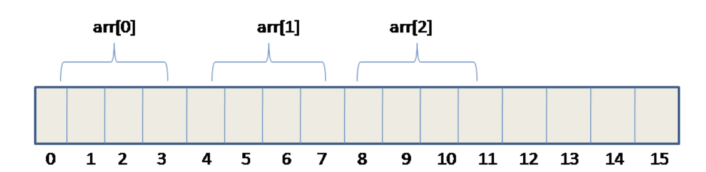

# Arrays em C

- [Arrays em C](#arrays-em-c)
  - [Introdução](#introdução)
  - [Declarar e Inicializar um Array](#declarar-e-inicializar-um-array)
  - [Aceder aos Elementos de um Array](#aceder-aos-elementos-de-um-array)
  - [Percorrer um Array](#percorrer-um-array)
  - [Passar um Array como Parâmetro para uma Função](#passar-um-array-como-parâmetro-para-uma-função)
  - [Organização de um array em memória](#organização-de-um-array-em-memória)
  - [Considerações Finais](#considerações-finais)


## Introdução

Um array em C é uma coleção de elementos do mesmo tipo de dados, armazenados em uma única variável. O uso de arrays é comum em C para armazenar e manipular grandes conjuntos de dados de forma eficiente.

## Declarar e Inicializar um Array

Para declarar um array em C, é necessário especificar o tipo dos elementos e o tamanho do array. Por exemplo, abaixo está como declarar um array de inteiros com tamanho 5:

```c
int meuArray[5];
```

Também se pode inicializar os elementos do array no momento da declaração. Por exemplo:

```c
int meuArray[5] = {1, 2, 3, 4, 5};
```

Ou ainda:

```c
int meuArray[] = {1, 2, 3, 4, 5};
```

O segundo exemplo acima é uma forma abreviada de inicializar o array, permitindo que o compilador calcule o tamanho do array automaticamente com base no número de elementos.

## Aceder aos Elementos de um Array

Pode aceder-se aos elementos de um array usando o índice do elemento. O primeiro elemento de um array tem índice `0`, o segundo tem índice `1` e assim por diante. Por exemplo:

```c
int meuArray[5] = {1, 2, 3, 4, 5};
printf("O primeiro elemento do array é %d\n", meuArray[0]); // imprime 1
printf("O segundo elemento do array é %d\n", meuArray[1]); // imprime 2
printf("O terceiro elemento do array é %d\n", meuArray[2]); // imprime 3
```

## Percorrer um Array

Você pode percorrer um array usando um loop `for`. Por exemplo:

```c
int meuArray[5] = {1, 2, 3, 4, 5};
int i;
for (i = 0; i < 5; i++) {
    printf("%d ", meuArray[i]);
}
```

Este exemplo percorre o array e imprime cada elemento no ecrã (`stdout` -standard output).

## Passar um Array como Parâmetro para uma Função

É possível passar um array como parâmetro para uma função em C. Por exemplo:

```c
void imprimeArray(int meuArray[], int tamanho) {
    int i;
    for (i = 0; i < tamanho; i++) {
        printf("%d ", meuArray[i]);
    }
}

int main() {
    int meuArray[5] = {1, 2, 3, 4, 5};
    imprimeArray(meuArray, 5);
    return 0;
}
```

Este exemplo define uma função `imprimeArray` que recebe um array e o seu tamanho como parâmetros. Dentro da função, o array é percorrido e os seus elementos são impressos no ecrâ. O array é passado para a função `imprimeArray` a partir da função main.

## Organização de um array em memória

Em C, um array é organizado na memória como uma sequência contígua de elementos do mesmo tipo. Isso significa que, quando se declara um array, todos os seus elementos são armazenados em posições consecutivas de memória.

Por exemplo, caso se declarar um array de inteiros com tamanho 5, os 5 inteiros serão armazenados em posições consecutivas de memória, como ilustrado abaixo:

```yaml


Índice do Array:     0      1      2      3      4
Posição na memória: 0000   0004   0008   0012   0016

Endereço do Array:  0000
Endereço do 1º elemento: 0000
Endereço do 2º elemento: 0004
Endereço do 3º elemento: 0008
Endereço do 4º elemento: 0012
Endereço do 5º elemento: 0016
```

Nesse exemplo, cada elemento do array ocupa 4 bytes de memória (pois é do tipo int), e cada posição de memória está espaçada por 4 bytes.




Quando se acede a um elemento de um array em C, o compilador calcula o endereço de memória do elemento com base no índice do array e no tamanho do tipo de dados. Por exemplo, para aceder ao terceiro elemento do array acima, o compilador calcula o endereço de memória 1008 da seguinte maneira:

```yaml
Endereço do 3º elemento = Endereço do Array + (Tamanho do Tipo de Dados * Índice do Elemento)
Endereço do 3º elemento = 1000 + (4 * 2)
Endereço do 3º elemento = 1008
```

Portanto, quando se acede ao terceiro elemento do array usando o índice 2, o compilador calcula o endereço de memória 1008 e retorna o valor armazenado nesse local. todas as posições de memória possuem um endereço único.

É importante lembrar que em C, não há verificação de limites de array em tempo de execução. Isso significa que podemos aceder a um elemento fora do limite do array, contudo o comportamento do programa é indefinido e pode levar a resultados inesperados ou a erros de memória (*segmentation fault*). Portanto, é importante garantir que todos os acessos a elementos do array sejam feitos dentro dos limites do array.

## Considerações Finais

Arrays são uma ferramenta poderosa em C para armazenar e manipular grandes conjuntos de dados de forma eficiente. Agora que você sabe como criar, inicializar e trabalhar com arrays em C, você pode usá-los em seus programas para armazenar e processar dados de forma mais fácil e eficiente.
