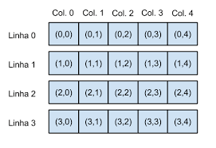

- [Introdução](#introdução)
- [Declaração escrita e leitura](#declaração-escrita-e-leitura)

# Introdução

Matrizes em C são estruturas de dados que permitem armazenar valores numa tabela bidimensional. Elas são compostas por linhas e colunas, e cada elemento da matriz pode ser acedido através de suas coordenadas (índices), que correspondem ao número da linha e da coluna.



# Declaração escrita e leitura

Para declarar uma matriz em C, é necessário especificar o número de linhas e colunas que a matriz terá e, em seguida, inicializar os valores da matriz. Veja um exemplo:

```c
#include <stdio.h>

int main() {
   int matriz[2][3] = { {1, 2, 3}, {4, 5, 6} };

   // aceder um elemento da matriz
   printf("matriz[0][1] = %d\n", matriz[0][1]); // saída: matriz[0][1] = 2

   return 0;
}

```
Ao declarar-se a variável `matriz` foi alocado em memória o espaço para se guardarem 6 inteiros. Neste caso foram ainda inicializados os valores da matriz através do comando `{ {1, 2, 3}, {4, 5, 6} }` indicando que a primeira linha recebe o valor `{1, 2, 3}` e a segunda `{4, 5, 6}`.

Contudo, se observar o exemplo abaixo pode verificar que o acesso a leitura e escrita dos valores da escrita pode ser efetuado através de dois ciclos entrelaçados, sendo usualmente utilizados ciclos `for`.

```c
include <stdio.h>
#include <stdlib.h>
#include <string.h>

//Macros de definição da dimensão da matriz
#define NUM_LINHAS 3
#define NUM_COLUNAS 3

int main(int argc, char const *argv[])
{
    int matriz[NUM_LINHAS][NUM_COLUNAS];

    // Solicitar dados ao user e gravar na memória alocada à matriz
    for (int i = 0; i < NUM_LINHAS; i++)
    {
        for (int j = 0; j < NUM_COLUNAS; j++)
        {
            printf("Insira MATRIZ[%d][%d]->", i, j);
            scanf("%d", &matriz[i][j]);
        }
    }

    // ler os valores da matriz e escrever no stdin
    for (int i = 0; i < NUM_LINHAS; i++)
    {
        for (int j = 0; j < NUM_COLUNAS; j++)
        {
            printf("[%d][%d]=%d\t", i, j, matriz[i][j]);   
        }
        puts("");
    }

    return EXIT_SUCCESS;
}
```
