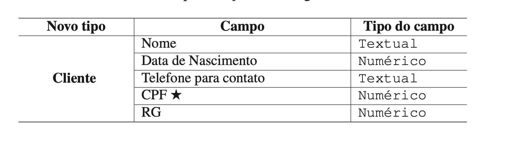

# Estruturas em C


As estruturas em C são uma forma de agrupar variáveis de diferentes tipos sob um mesmo nome, facilitando e criando a capacidade de gestão e utilização de dados complexos. São especialmente úteis em programas maiores, onde elementos relacionados podem ser mantidos juntos para maior organização e clareza. 

Utilizamos estruturas quando desejamos criar um tipo de dado para reunir informações sobre o que desejamos representar. Numa estrutura, as informações são organizadas em campos. Uma analogia de uma estrutura pode ser vista quando preenchemos um formulário. Um exemplo poderia ser o de um formulário para registar Clientes. Os campos do formulário são preenchidos com os dados do cliente que nos interessa registrar.
Sabendo as informações que desejamos registrar sobre um Cliente (ou seja, os dados sobre cada cliente relevantes para a nossa aplicação), podemos então esquematizar uma estrutura, considerando os tipos de dado de cada campo:



Vamos explorar como usar estruturas através de uma série de exemplos.

## Definição de uma Estrutura

Para definir uma estrutura, utilizamos a palavra-chave `struct` seguida por um identificador *opcional* (o nome da estrutura) e um bloco de definições de campo entre chavetas (`{...}`). Por exemplo, para representar um ponto  num sistema de coordenadas 2D, podiamos criar a seguinte estrutura:

```c
struct ponto {
    int x;
    int y;
};
```

Ou para o caso do cliente, fazendo a declaração da estrutura e criando um novo tipo de dado chamado `Cliente`:

```c

typedef struct _cliente {
    char nome[100];
    int ano_nascimento;
    char telefone[12];
    //etc....
} Cliente;

```

## Declarar Variáveis de uma Estrutura

Depois de definir uma estrutura, é possível declarar variáveis desse tipo de duas formas distintas:

1. **Declarando diretamente com o nome da estrutura:**

```c
struct ponto p1, p2;
```

2. **Utilizando o typedef para criar um novo tipo de dado:**

```c
typedef struct ponto Ponto;
Ponto p3, p4;
```

De qualquer modo, com a estrutura declarada, seria agora possível criar variáveis que representam pontos. Ou seja quando declaramos uma variável é criado em memória. Ou seja por cada variável criada, poderiamos definir o valor das subvariáveis (variáveis internas da estrutura) `x` e `y`


## Inicializar Estruturas

Podemos inicializar uma estrutura no momento da declaração, especificando os valores dos seus campos entre chavetas:

```c
struct Ponto p1 = {0, 0}; // x = 0, y = 0
```

## Acesso aos Membros de uma Estrutura

Para aceder ou modificar os membros (campos) de uma estrutura, podemos usar o operador de ponto (`.`):

```c
p1.x = 10;
p1.y = 20;
printf("Ponto: (%d, %d)\n", p1.x, p1.y);
```

## Estruturas e Ponteiros

Quando temos um ponteiro para uma estrutura, usamos o operador de acesso (`->`) para aceder aos seus membros:

```c
struct Ponto *ptr = &p1;
ptr->x = 30; // Equivalente a (*ptr).x = 30;
printf("Ponto: (%d, %d)\n", ptr->x, ptr->y);
```

## Estruturas dentro de estruturas

Estruturas podem ser aninhadas, significando que uma estrutura pode conter outra estrutura como membro. Esta possibilidade é útil para representar relações hierárquicas. Veja o exemplo abaixo:

```c
struct Endereco {
    char rua[50];
    int numero;
};

struct Pessoa {
    char nome[50];
    struct Endereco endereco;
};

struct Pessoa pessoa;
strcpy(pessoa.nome, "João");
strcpy(pessoa.endereco.rua, "Rua das Flores");
pessoa.endereco.numero = 123;
```

## Passagem de Estruturas para Funções

As Estruturas podem ser passadas para funções por valor (copiando todos os dados da estrutura) ou por referência (usando um ponteiro para a estrutura):

- **Por valor:** Cópia inteira da estrutura é feita, o que pode ser ineficiente para estruturas grandes. Além disso lembre-se que, neste caso, ao se alterar os valores dos campos de uma estrutura dentro da função, estamos na realidade a alterar os dados numa cópia da estrutura original (que foi copiada para dentro dessa função).

```c
void printPonto(struct Ponto p) {
    printf("(%d, %d)\n", p.x, p.y);
}
```

- **Por referência:** Mais eficiente, especialmente para estruturas grandes, pois apenas o endereço da estrutura é passado. Neste caso porque o endereço é passado, todas as alterações efetuadas dentro da função refletem-se na estrutura original.

```c
void moverPonto(struct Ponto *p, int dx, int dy) {
    p->x += dx;
    p->y += dy;
}
```

### Conclusão

Estruturas em C são fundamentais para o desenvolvimento de programas estruturados e eficientes, permitindo que os programadores agrupem dados relacionados. Ao usar estruturas, podemos criar tipos de dados mais complexos que refletem melhor as entidades e conceitos do mundo real. 