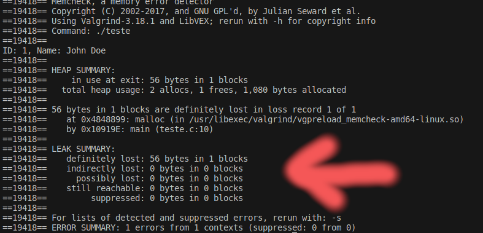
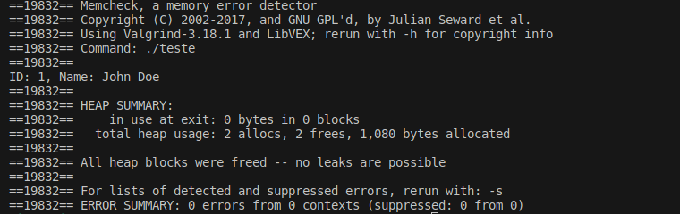

# Alocação Dinâmica de memória

A alocação dinâmica de memória em C permite que os programas solicitem e libertem memória em tempo de execução, conforme necessário. Isso é especialmente útil para estruturas de dados cujo tamanho não é conhecido em tempo de compilação ou que pode mudar durante a execução do programa. As funções para gerenciar memória dinâmica estão definidas na biblioteca `<stdlib.h>`, e incluem `malloc()`, `calloc()`, `realloc()`, e `free()`.

## `malloc()`

A função `malloc()` (memory allocation) aloca um bloco de memória do tamanho especificado e retorna um ponteiro para o início desse bloco. A memória alocada não é inicializada, podendo conter lixo.

```c
#include <stdio.h>
#include <stdlib.h>

int main() {
    int *ptr = (int*)malloc(sizeof(int)); // Aloca memória para um inteiro
    if (ptr != NULL) {
        *ptr = 10; // Atribui um valor ao inteiro alocado
        printf("%d\n", *ptr);
        free(ptr); // Liberta a memória alocada
    }
    return 0;
}
```

## `calloc()`

A função `calloc()` (contiguous allocation) aloca memória para um array de elementos de um determinado tamanho, inicializando todos os bits a zero.

```c
#include <stdio.h>
#include <stdlib.h>

int main() {
    int *array = (int*)calloc(5, sizeof(int)); // Aloca memória para um array de 5 inteiros
    if (array != NULL) {
        for (int i = 0; i < 5; i++) {
            printf("%d ", array[i]); // Imprime os valores inicializados (0)
        }
        free(array); // Liberta a memória alocada
    }
    return 0;
}
```

## `realloc()`

A função `realloc()` (re-allocation) redimensiona o bloco de memória previamente alocado para um novo tamanho. Se o novo tamanho for maior, a memória adicional não será inicializada. Se o novo tamanho for menor, os dados excedentes serão perdidos.

```c
#include <stdio.h>
#include <stdlib.h>

int main() {
    int *array = (int*)malloc(5 * sizeof(int)); // Aloca memória para um array de 5 inteiros
    for (int i = 0; i < 5; i++) {
        array[i] = i;
    }

    int *newArray = (int*)realloc(array, 10 * sizeof(int)); // Redimensiona o array para 10 inteiros
    if (newArray != NULL) {
        for (int i = 5; i < 10; i++) {
            newArray[i] = i;
        }
        for (int i = 0; i < 10; i++) {
            printf("%d ", newArray[i]);
        }
        free(newArray); // Liberta a memória alocada
    }
    return 0;
}
```

## `free()`

A função `free()` libera um bloco de memória previamente alocado, tornando-o disponível novamente para o sistema. É importante liberar toda a memória que você alocou dinamicamente para evitar vazamentos de memória.

```c
free(ptr);
```

## Testar a memória de um programa

Valgrind é uma ferramenta de programação que oferece várias funcionalidades para depuração de programas. É especialmente conhecida pela sua capacidade de detectar problemas de memória, como vazamentos de memória e uso incorreto de memória. 

### O que é Valgrind?

Valgrind é um conjunto de ferramentas para depuração programas. A funcionalidade mais conhecida é o Memcheck, que pode detectar muitos erros relacionados à memória, como:

- Acesso a memória que não deveria ser acedida (acessos fora dos limites de um array, por exemplo).
- Uso de valores não inicializados.
- Liberação incorreta de memória alocada dinamicamente.
- Vazamentos de memória, onde a memória alocada não é libertada quando o programa termina.

### Instalação do Valgrind no Ubuntu

Para instalar o Valgrind no Ubuntu, abra o terminal e execute o seguinte comando:

```sh
sudo apt-get update
sudo apt-get install valgrind
```

Este comando atualizará a lista de pacotes e instalará o Valgrind.

### Exemplo de Programa em C

Vamos criar um exemplo de programa em C que aloca memória dinamicamente para uma estrutura usando `malloc` e `typedef`. Este programa terá um vazamento de memória intencional para demonstrar como o Valgrind pode detectá-lo.

Primeiro, defina a estrutura e aloque memória:

```c
#include <stdio.h>
#include <stdlib.h>

typedef struct {
    int id;
    char name[50];
} Person;

int main() {
    Person *person = (Person *)malloc(sizeof(Person)); // Aloca memória para uma pessoa
    
    if (person != NULL) {
        person->id = 1;
        snprintf(person->name, 50, "John Doe");
        
        printf("ID: %d, Name: %s\n", person->id, person->name);
        
        // Intencionalmente não é libertada a memória
        // free(person); // este comando deveria ser feito para evitar vazamento de memória
    }
    
    return 0;
}
```

Compile o programa com o gcc:

```sh
gcc person_example.c -g -o person_example 
```

O parâmetro `-g` adiciona informações de depuração ao executável, o que ajuda o Valgrind a fornecer saídas mais detalhadas.

### Usar Valgrind para Detectar Vazamentos de Memória

Para verificar o programa com Valgrind, use o comando:

```sh
valgrind  ./person_example
```

ou para obter informações mais detalhadas

```sh
valgrind --leak-check=full ./person_example
```

Valgrind executará o programa e reportará os vazamentos e erros de memória detectados. A opção `--leak-check=full` diz ao Valgrind para fazer uma análise detalhada de vazamento de memória.

### Interpretando a Saída do Valgrind

A saída do Valgrind mostrará detalhes sobre o vazamento de memória, incluindo onde a memória foi alocada. A partir dessas informações, é possível identificar e corrigir vazamentos e erros de memória no programa.

em relação ao programa anterior veja a saída quando há vazamentos de memória (não foi efetuado o free)



E agora libertando corretamente a memória, que é o que se pretende em todos os programas. Repare na frase `All heap blocks were freed -- no leaks are possible`


