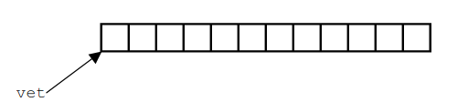
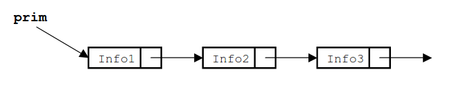
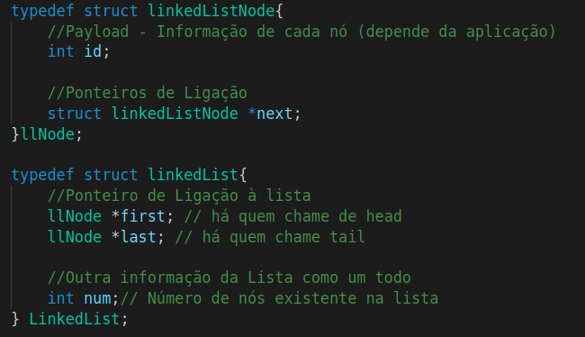
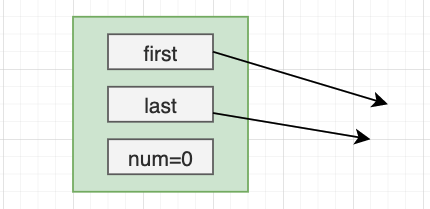
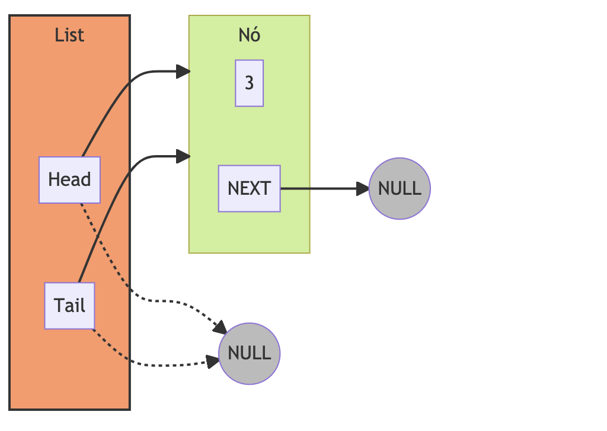
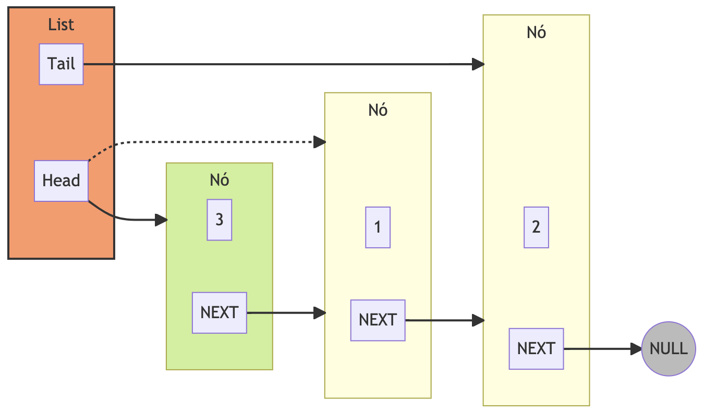
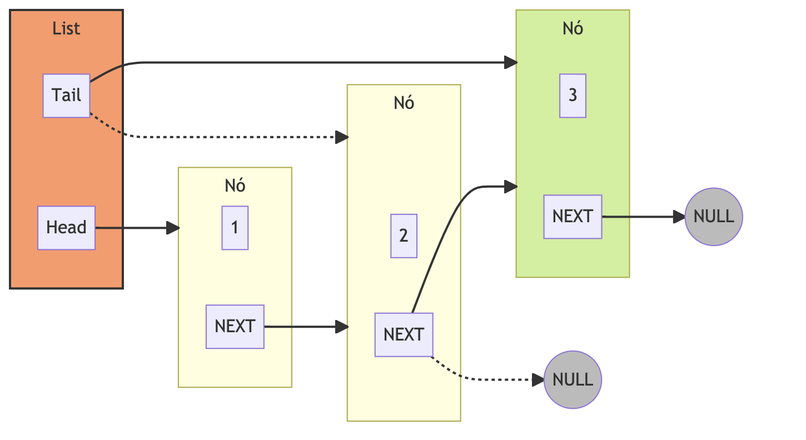
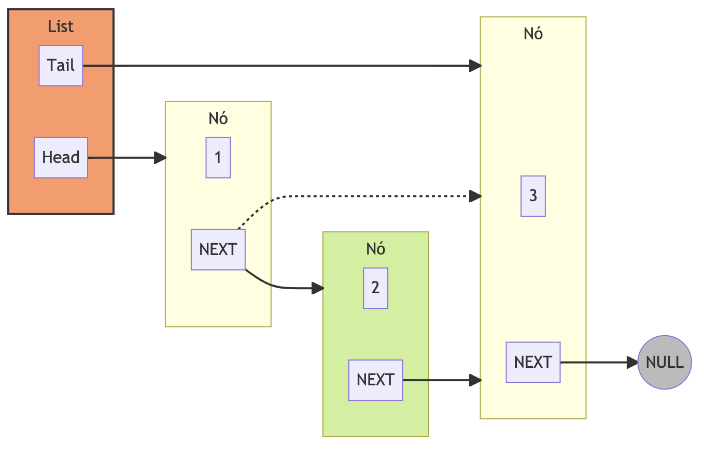

# Listas - Enquadramento Genérico

- [Listas - Enquadramento Genérico](#listas---enquadramento-genérico)
- [Listas Encadeadas Simples](#listas-encadeadas-simples)
  - [Funções sobre Listas](#funções-sobre-listas)
    - [Inicialização](#inicialização)
    - [Inserção](#inserção)
      - [No início da Lista](#no-início-da-lista)
      - [No final da Lista](#no-final-da-lista)
      - [Num local relativo à ordenação que se pretenda implementar (Sorted Insert)](#num-local-relativo-à-ordenação-que-se-pretenda-implementar-sorted-insert)
    - [Busca](#busca)
    - [Eliminação](#eliminação)
    - [Imprimir Lista](#imprimir-lista)
    - [Número de Elementos da Lista](#número-de-elementos-da-lista)
    - [Libertação de Recursos](#libertação-de-recursos)
- [Listas Duplamente Encadeadas](#listas-duplamente-encadeadas)
  - [Definição](#definição)
  - [Estruturas de Dados](#estruturas-de-dados)
  - [Implementação](#implementação)
- [Mais recursos referentes à matéria](#mais-recursos-referentes-à-matéria)
- [Bibliografia usada](#bibliografia-usada)


Para representarmos um grupo de dados, já vimos que podemos usar um vetor em C. O vetor é a forma mais primitiva de representar diversos elementos agrupados. Para simplificar a discussão dos conceitos que serão apresentados agora, vamos supor que temos que desenvolver uma aplicação que deve representar um grupo de valores inteiros. Para tal, podemos declarar um vetor escolhendo um número máximo de elementos.

```c
#define MAX 1000
int vet[MAX];
```

Ao declararmos um vetor, reservamos um espaço contíguo de memória para armazenar os seus elementos, conforme ilustra a figura abaixo.



*Um vetor ocupa um espaço contíguo de memória, permitindo que qualquer elemento seja acedido indexando-se o ponteiro para o primeiro elemento.*

Porque o vetor ocupa um espaço contíguo na memória é possível aceder a qualquer um dos seus elementos a partir do ponteiro que aponta para o primeiro elemento. De fato, a variável `vet`, após a declaração acima, como já vimos, representa um ponteiro para o primeiro elemento do vetor, isto é, o  valor de vet  é  o  endereço da memória onde o  primeiro elemento do vetor está armazenado. 

Tendo o ponteiro para o  primeiro elemento,podemos aceder a qualquer elemento do vetor através do operador de indexação `vet[i]`. Dizemos que o vetor é uma estrutura que possibilita acesso aleatório aos elementos, pois podemos aceder a qualquer elemento aleatoriamente. 

No entanto, o  vetor não é  uma estrutura de dados muito flexível, pois precisamos dimensioná-lo com um número máximo de elementos. Se o número de elementos que precisarmos armazenar exceder a dimensão do vetor, teremos um problema, pois não existe uma maneira simples e barata (computacionalmente) para alterarmos a dimensão do vetor em tempo de execução. Por outro lado, se o  número de elementos que necessitamos de armazenar no vetor for muito inferior à  sua dimensão, estaremos sub-utilizando o espaço de memória reservado.

A solução para esses problemas é utilizar estruturas de dados que cresçam à medida que precisarmos de armazenar novos elementos (e diminuam à medida que é necessário retirar elementos armazenados anteriormente). Tais estruturas são chamadas dinâmicas e armazenam cada um dos seus elementos usando alocação dinâmica. Nas secções a seguir, Será apresentado a estrutura de dados conhecida como lista encadeada. As listas encadeadas são amplamente usadas para implementar diversas outras estruturas de dados com semânticas próprias, que serão tratadas também nesta UFCD.

# Listas Encadeadas Simples
Numa lista encadeada, para cada novo elemento inserido na estrutura, alocamos um espaço de memória para armazená-lo. Desta forma, o  espaço total de memória gasto pela estrutura é proporcional ao número de elementos nela armazenado. No entanto, não podemos garantir que os elementos armazenados na lista ocuparão um espaço de memória contíguo, portanto não temos acesso direto aos elementos da lista. Para que seja possível percorrer todos os elementos da lista, devemos explicitamente guardar o encadeamento dos elementos, o que é feito armazenando-se, junto com a informação de cada elemento, um ponteiro para o  próximo elemento da lista. A Figura abaixo ilustra o arranjo da memória de uma lista encadeada.



A estrutura consiste numa sequência encadeada de elementos, em geral chamados de nós da lista. A lista é representada por um ponteiro para o primeiro elemento (ou nó).Do primeiro elemento, podemos alcançar o segundo seguindo o encadeamento, e assim por diante. O último elemento da lista aponta para `NULL`, sinalizando que não existe um próximo elemento.

Para exemplificar a  implementação de listas encadeadas em C, vamos considerar um exemplo simples em que queremos armazenar valores inteiros numa lista encadeada. O nó da lista, bem como a estrutura que armazena a informação genérica sobre a lista pode ser representado pela estrutura abaixo:



Devemos notar que trata-se de uma estrutura auto-referenciada, pois, além do campo que armazena a  informação (no caso, um número inteiro), há um campo que é  um ponteiro para uma próxima estrutura do mesmo tipo. Na imagem apresentada existem duas estruturas. Uma que representa um nó da lista, que terá uma área com informação de cada nó, dependendo essa informação da implementação que se pretender, e uma outra que nos garante a ligação ao nó seguinte, possibilitando percorrer toda a lista. Uma segunda estrutura, guarda os ponteiros que apontam para a lista em sí. Devemos, pelo menos possuir um apontador para o primeiro elemento, podendo, consoante a implementação possuir um ponteiro que aponta para o último elemento, o que poderá facilitar algumas operações que se pretendem fazer sobre a lista.

Considerando a definição de Lista, podemos definir as principais funções necessárias para implementarmos uma lista encadeada. Neste caso, nos exemplos abaixo, iremos criar uma lista que possui um ponteiro para o primeiro e, um outro, para o último, bem como uma variável onde vamos guardar o número de nós existentes.

Iremos de seguida implementar um conjunto de funções sobre listas. NEste caso iremos supor que cada nó possui um ID, o qual terá que ser único.

## Funções sobre Listas

### Inicialização
A função que inicializa uma lista deve criar uma lista vazia, sem nenhum elemento. Como a lista é representada (segurada) pelo ponteiro para o primeiro elemento, uma lista vazia é representada pelo ponteiro que aponta para o primeiro elemento iniciado a `NULL`,  pois não existem elementos na lista. 
No código abaixo, pode ver-se que se aloca espaço para a estrutura que controla a lista, iniciando os ponteiros que aponta para o primeiro e último elemento a `NULL`. Como variável de apoio possuímos ainda o número de elementos na lista, que é inicializado a 0.



```c
/**
 * Cria uma Lista encadeada
 * @return ll Lista criada e inicializada
 **/
LinkedList *new_linkedList(){
    LinkedList *ll=malloc(sizeof(LinkedList));
    //Iniciar ponteiros e contador
    ll->first=NULL;
    ll->last=NULL;
    ll->num=0;
    //Retorna o ponteiro para a lista inicializada
    return ll;
}
```
Neste caso, para se iniciar uma lista e se utilizar as funcionalidades deve-se invocar a função

```c
#include "ll.h" //Biblioteca onde estão declaradas as funções da lista

int main(int argc, char const *argv[])
{
    LinkedList *lista1=new_linkedList();
    LinkedList *lista2=new_linkedList();
    return EXIT_SUCCESS;
}
```

### Inserção

#### No início da Lista
Uma vez criada a lista vazia, podemos inserir novos elementos nela. Para cada elemento
inserido na lista, devemos alocar dinamicamente a memória necessária para armazenar
o elemento e encadeá-lo na lista existente. A função de inserção mais simples insere o
novo elemento no início da lista.

Nesta situação dois casos podem acontecer. Caso seja o primeiro elemento a ser inserido na lista, ou seja, no caso de a lista estar vazia. Nesta situação teremos que apontar o ponteiro `last` para esse nó. Caso já exista pelo menos um nó na lista, basta alocar em memória o nó a criar, redefinir o apontador para o primeiro elemento e fazer a ligação entre os nós. 

<details>
<summary markdown="span"><ins >Imagem e código (Clicar para abrir)</ins></summary>



Neste caso, os apontadores para o primeiro e último elemento da lista estavam a `NULL`. Como o nó a inserir (Nó 3) passará a ser o primeiro e último elemento, pois é único, ambos passarão a apontar para ele. A tracejado encontra-se o estado dos apontadores antes da inserção.



Neste caso pretende-se inserir o nó 3 no início. O apontador que aponta para o primeiro elemento (Head), que antes era o nó 1 (representado a tracejado), passa a apontar para o elemento inserido (Nó 3).

Uma possível implementação poderia ser (*Note que o código não está otimizado para melhor compreensão. Isto é, existem comandos repetidos que podiam ser evitados*):

```c
void insert_element_begin(LinkedList *ll, int id)
{
    //Se ID existir não insere
    if (get_element(ll, id))
        return;

    llNode *n = malloc(sizeof(llNode));
    n->id = id;
    ll->num++; //incrementa número de nós
    //Testar se é o primeiro elemento
    if(!ll->first){
        //Caso seja o primeiro elemento
        ll->first=n;
        ll->last=n;
        n->next=NULL;
        return;
    }
    //Se chegamos aqui é porque não é o primeiro
    n->next=ll->first;//Apontador next aponta para o que era o anterior primeiro nó
    ll->first=n;//n passa a ser o primeiro nó da lista
    return;
}
```

</details>

#### No final da Lista
Neste caso pretende-se inserir no final da lista. Para o efeito, analisando os possíveis caso verifica-se que ao tentar inserir no final da lista, podemos ter os seguintes cenários:
- A lista ainda se encontra vazia (primeiro nó que vai ser inserido) - Neste caso iremos ter que apontar o ponteiro que aponta para o ínicio da lista, bem como o ponteiro qua aponta para o último elemento, ambôs com valor `NULL` pois não existiam elementos (*igual ao apresentado acima para a inserção no início da lista*);
- A lista já possui pelo menos um nó - Neste caso só teremos que acertar o ponteiro que aponta para o final da lista, pois o novo elemento passou a ser o último, bem como garantir que o elemento anterior da lista, aponta agora para o nó a inserir

<details>
<summary markdown="span" style="color:red"><ins >Imagem e código (Clicar para abrir)</ins></summary>



*A inserção do nó 3, a verde, necessita que sejam alterados os ponteiros a tracejado(que representa o seu estado antes da inserção)*

```c

void insert_element_end(LinkedList *ll, int id)
{
    //Se ID existir não insere
    if (get_element(ll, id))
        return;

    llNode *n = malloc(sizeof(llNode));
    n->id = id;
    n->next = NULL; //Porque este vai ser o último

    if (ll->first == NULL)
    {
        //Caso especial Primeiro elemento
        ll->first = n;
        ll->last = n;
        ll->num++;
        return;
    }
    //Se cheguei aqui não é o primeiro elemento.
    ll->last->next = n;
    ll->last = n;
    ll->num++;
}

```
</details>

#### Num local relativo à ordenação que se pretenda implementar (Sorted Insert)
Neste caso pretende-se inserir os nós por ordem crescente do ID. Neste caso implementou-se o método seguindo os vários cenários possíveis. Mais uma vez ressalva-se o facto de o código não estar propositadamente otimizado, para melhor compreensão. 
1. Caso o ID já exista sai e não insere.
2. Caso a lista ainda não possua nós, insere e aponta-se os apontadores que sustentam a lista (*igual ao já apresentado acima*)
3. Caso o elemento a inserir seja o ID mais baixo da lista, ou seja se pretenda inserir no início da lista (*Ver acima a inserção no início*)
4. Caso o nó seja para inserir no meio dos nós já existentes, insere-se e acertam-se os apontadores `next` do nó anterior e do nó a inserir de forma a garantir a sequência da lista. Na realidade este caso é a única novidade em relação ao já apresentado acima. Para mais detalhe veja imagem e código abaixo
5. caso seja para inserir no fim da lista, pois o ID do novo nó é o maior dos que já existem (*Ver a inserção no fim da lista*)


<details>
<summary markdown="span"><ins >Função insert, de forma ordenada (Clicar para abrir)</ins></summary>



*Neste caso não é necessário alterar os apontadores que seguram a lista (Head e Tail). Para manter a ligação entre nós, de forma ordenada, o ponteiro `NEXT` do nó anterior deve apontar para o inserido (Nó 2), apontando o ponteiro do do nó inserido para o próximo da lista (Nó 3)*

```c
void insert_element_sort(LinkedList *ll, int id)
{
    //Se ID existir não insere
    if (get_element(ll, id))
        return;

    llNode *n = malloc(sizeof(llNode));
    n->id = id;
    ll->num++; //incrementa número de nós

    //testa se a lista está vazia
    if (!ll->first)
    {
        n->next = NULL;
        ll->first = n;
        ll->last = n;
        return;
    }
    //se chegamos aqui a lista não está vazia

    //Verifica se o no a inserir é o ID mais baixo da lista
    if (ll->first->id > id)
    {
        //Insere-se o nó no principio
        n->next=ll->first;
        ll->first=n;
        return;
    }

    //Se chegamos aqui vamos ter que procurar a posição
    llNode *tmp = ll->first;
    while (tmp)
    {
        if(!tmp->next)//Caso o proximo seja nulo sai do ciclo e insere no fim
            break;
        if(tmp->next->id > id){
            //insere nesta posição
            n->next=tmp->next;
            tmp->next=n;
            return;
        }
        tmp=tmp->next;
    }

    //Se cheguei aqui vou inserir no fim
    n->next=NULL;
    tmp->next=n;
    ll->last=n;
}
```

</details>

---

### Busca
Uma operação de busca, ou procura, tem como finalidade procurar determinado elemento. Obviamente que um função deste tipo tem mais lógica no caso de estarmos a implementar uma lista que exija que todos os elementos possuem uma chave (ID) único, o qual não se pode repetir. Neste caso uma possível implementação encontra-se abaixo.
A ideia subjacente é iniciar o percurso pela lista no primeiro nó, e ir percorrendo a mesma através do ponteiro `next` de cada elemento e ir comparando com a chave de busca, neste caso um inteiro denominado por `id`.

```c

/**
 * Procura o nó com determinado ID
 * @param ll 
 * @param id 
 * @return llNode Devolve null caso não seja encontrado
 */
llNode *get_element(LinkedList *ll, int id)
{
    llNode *n = ll->first;
    while (n)
    {
        //Testa se id é igual
        if (n->id == id)
        {
            //Se entrei aqui quer dizer que achei o meu nó
            return n;
        }
        n = n->next;
    }
    return NULL;
}

```

### Eliminação
A operação de eliminar um elemento da lista apresenta algumas singularidades que importa detalhar. Para implementar esta função optou-se por não apresentar o código otimizado, mas sim que o mesmo possa retratar os diversos cenários que podem acontecer quando se invoca a função para eliminar o nó com determinado `id`.
- Caso o id não exista, nada é apagado da lista;
- Caso só exista um nó na lista: neste caso é necessário acertar a `NULL` ambos os ponteiros `first` e `last`que apontam para o mesmo sítio;
-  Caso seja o último nó da lista onde será necessário reapontar o ponteiro `next`do nó anterior e o ponteiro `last`;
-  Por último o caso geral onde o nó a retirar se encontra no meio. Neste caso só é necessário definir que o ponteiro `next`do nó anterior passa a apontar para o nó seguinte, retirando-se esse nó do meio.

```c

/**
 * @brief Apaga o elemento com o id da lista
 * 
 * @param ll - Lista onde inserir
 * @param id - id do nó a inserir.
 */
void delete_element(LinkedList *ll, int id)
{
    llNode *n = get_element(ll, id);
    //Se ID não existir sair
    if (!n)
        return;

    ll->num--;
    //Caso Único nó na lista
    if (ll->first == n && ll->last == n)
    {
        ll->first = NULL;
        ll->last = NULL;
        free(n);
        return;
    }

    //Caso seja o primeiro
    if (ll->first == n)
    {
        ll->first = n->next;
        free(n);
        return;
    }

    //procura nó anterior ao que se vai apagar
    llNode *temp = ll->first;
    while (temp->next != ll->last)
    {
        temp = temp->next;
    }
    //Quando chego aqui temp aponta para nó anterior
    //Caso seja o último
    if (ll->last == n)
    {
        temp->next = NULL;
        ll->last = temp;
        free(n);
        return;
    }

    //Caso contrario
    temp->next = n->next;
    free(n);
    return;
}


```

### Imprimir Lista
A operação de imprimir a lista é muito similar à operação de busca. Percorre-se a lista, do início para o fim pois só possuímos ponteiros `next`, e vamos imprimindo a informação contida no nó. Embora o aspeto gráfico dessa operação possa ser o que o programador quiser, apresenta-se uma possível implementação.

```c

/**
 * @brief Imprime a lista
 * 
 * @param ll Lista a imprimir
 */
void print_list(LinkedList *ll)
{
    llNode *n = ll->first;
    printf("********LISTA (%i) ******\n", ll->num);
    while (n)
    {
        printf("\t->%d\n", n->id);
        n = n->next;
    }
    return;
}

```

### Número de Elementos da Lista
Uma função não essencial, mas que pode ser útil em determinadas circunstancias é obter o número de elementos numa lista. Esta operação pode ser implementada contando o número de elementos na lista, ou, no nosso caso, através do valor de uma variável criada e inserida na estrutura para o efeito.

```c

/**
 * @brief Retorna o número de elemento na lista ll
 * 
 * @param ll 
 * @return int 
 */
int numberNodesList(LinkedList* ll){
    return ll->num;
}

```
### Libertação de Recursos
Para a libertação dos recursos, situação que deve ser efetuada quando a estrutura Lista já não é necessária, ou antes de sair da aplicação, é necessário percorrer toda a lista apagando cada nó, e no final apagar a Lista em sí.

```c

/**
 * @brief Liberta memória da lista ll
 * 
 * @param ll 
 */
void freeList(LinkedList *ll)
{
    llNode *n = ll->first;
    llNode *temp;
    while (n)
    {
        temp = n;
        n = n->next;
        free(temp);
    }
    free(ll);
}

```

# Listas Duplamente Encadeadas
## Definição

## Estruturas de Dados

## Implementação

# Mais recursos referentes à matéria
- [GeeksForGeeks](https://www.geeksforgeeks.org/linked-list-set-1-introduction/)
- [Learn C](https://www.learn-c.org/en/Linked_lists)
- [Universidade São Paulo ](https://www.ime.usp.br/~pf/algoritmos/aulas/lista.html)
- [Universidade de Coímbra](http://www.mat.uc.pt/~amca/ED0506/FinalListas.pdf)

# Bibliografia usada
- [Universidade de Coímbra](http://www.mat.uc.pt/~amca/ED0506/FinalListas.pdf)
- Aaron M. Tenenbaum, Yedidyah Langsam, Moshe J. A. (1995). Tradução Teresa Cristina Félix de Souza. São Paulo, MAKRON Books.
- Celes, W., Cerqueira, R., & Rangel,J. L. (2004). Introdução às Estruturas de Dados. Campus Editora
- Srivastava, S. K., & Srivastava, D. (2016). Data Structures and Algorithms Using C. BPB Publications.
- Jain, H. (2017). Problem Solving in Data Structures & Algorithms Using C. 
- Malhotra, D., & Malhotra, N. (2019). Data Structures and Program Design using C. Mercury Learning and Information LLC.
