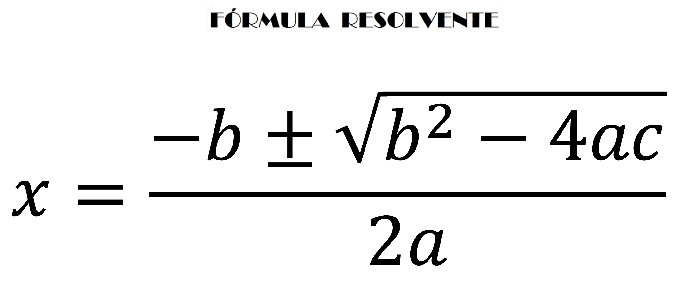

# Estruturas Decisão Condicional - Ex05
Efetue um programa em C que escreva no ecrã as raízes reais de uma equação do 2º grau, na forma `ax2 + bx + c = 0`, sendo os valores a, b e c reais (float ou double) e solicitados ao utilizador. Como sabe as raízes de uma equação de segundo grau podem ser encontradas utilizando para o efeito a fórmula resolvente. 



- Instruções
    - Criar um ficheiro ex05.c
    - Compilar com o comando `gcc ex05.c -o ex05.out -lm`
    - Executar com `./ex05.out`

- Dicas
  - Para a equação poder ser resolvida, `a` deve ser diferente de zero. Caso a==0, deve ser escrito no ecrã `A equação não pode ser resolvida`;
  - Caso (b2 - 4ac), ou seja o valor dentro da raiz e que se chama discriminante seja:
    - **0** A equação tem uma só raiz - Escreve a raiz no ecrã
    - **>0** A equação possui duas raízes reais: Escreve as duas raizes no ecrã
    - **<0** A equação não possui raízes reais. Deve escrever no ecrã que a equação não possui raizes reais.
  - Aprende mais sobre equações de segundo grau [aqui](https://pt.wikipedia.org/wiki/Equa%C3%A7%C3%A3o_quadr%C3%A1tica)
  - Para calcular a raiz quadrada devem adicionar ao programa a biblioteca `math.h`. Vejam o exemplo abaixo, onde está presente o include da biblioteca e a função que calcula a raiz quadrada. **Atenção que na compilação esta deve ser feita passando a flag -lm. Por exemplo este exercício deve ser compilado com `gcc ex05.c -o ex05.out -lm`**
```C
#include <stdio.h>
#include <stdlib.h>
#include <string.h>
#include <math.h>

int main(int argc, char const *argv[])
{

    double x = 9.0;
    int n = 4;
    double result1, result2;
    result1 = sqrt(n); //utilização com um inteiro
    result2 = sqrt(x);

    printf("Raiz quadrada de %d é %lf\n", n, result1);
    printf("Raiz quadrada de %lf é %lf\n", x, result2);

    return EXIT_SUCCESS;
}
```


Exemplo do comportamento esperado da aplicação:
```text
insira a->1
insira b->2
insira c->-15
Existem duas raízes: (3,-5)
```
```text
insira a->0
insira b->2
insira c->-15
a=0, não pode ser calculado
```
```text
insira a->1
insira b->2
insira c->1
Existe uma raíz: (-1)
```

```text
insira a->1
insira b->2
insira c->4
A equação não possuí raízes reais
```

Pode utilizar a seguinte [calculador](https://www.matematica.pt/util/calculadora-equacao-2-grau.php) para testar se o teu programa está correto


