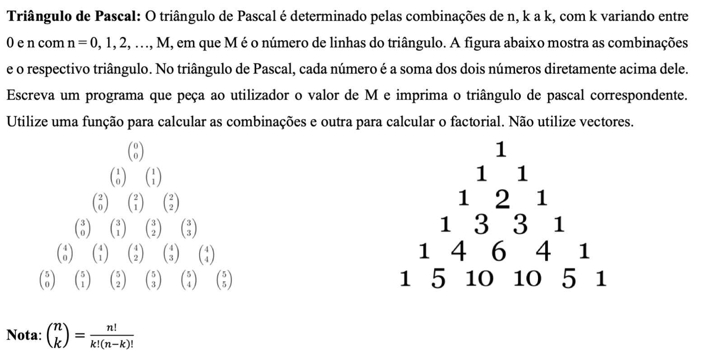

# Ciclos Ex 08
Escreva um programa que solicite um inteiro maior que zero e escreva o triângulo de pascal.
o inteiro pedido é o número de linhas. O triângulo de pascal tem como propriedade que o número de baixo resulta da soma dos de cima

```shell
Insira n->5
        1
      1   1 
    1   2   1 
  1   3   3   1
1   4   6   4   1 
```

Dica: Algoritmo para calcular triângulo de Pascal


