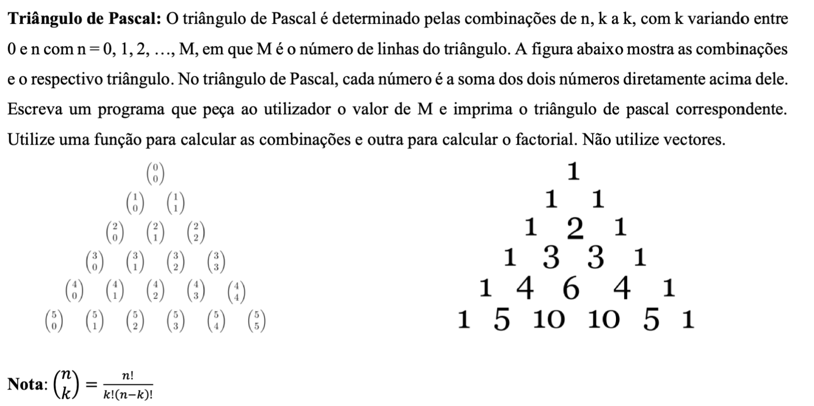

# Funções Ex 05
A partir do exercício 8 dos ciclos:
> Escreva um programa que solicite um inteiro **impar maior que zero** e escreva o triângulo de pascal.
o inteiro pedido é o número de linhas. O triângulo de pascal tem como propriedade que o número de baixo resulta da soma dos de cima

```shell
Insira n->5
        1
      1   1 
    1   2   1 
  1   3   3   1
1   4   6   4   1 
```
Escreva o mesmo programa utilizando funções e recursividade. Cada posição do triângulo de pascal pode ser calculada com base na seguinte formula e explicação:


